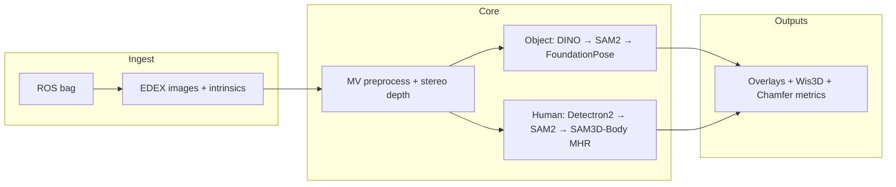

# Video to Data (V2D)

Monorepo for **Video to Data (V2D)** — an end-to-end stack that turns human demonstration capture (monocular or multi-view video, stereo rigs, ROS bags) into dense 3D understanding (depth, segmentation, meshes, articulated human models, object poses) and then into **simulation-ready scenes** and **reinforcement-learning policies** for grounded robotics.

This repository is split into two major packages: **`reconstruction/`** (vision and 3D, Docker-orchestrated) and **`robotic_grounding/`** (Isaac Lab environments, retargeting, RSL-RL training). They are developed together so reconstructed assets and human motion can flow into robot learning without ad-hoc glue code.

---

## Table of contents

- [How the stack fits together](#how-the-stack-fits-together)
- [Repository layout](#repository-layout)
- [Requirements](#requirements)
- [Reconstruction quick path](#reconstruction-quick-path)
- [Robotic grounding quick path](#robotic-grounding-quick-path)
- [Pipelines and data flow](#pipelines-and-data-flow)
- [Reconstruction modules (catalog)](#reconstruction-modules-catalog)
- [Orchestration vs inference](#orchestration-vs-inference)
- [Continuous integration](#continuous-integration)
- [Documentation map](#documentation-map)
- [Design philosophy](#design-philosophy)
- [Contributing](#contributing)

---

## How the stack fits together

```
 ┌────────────────┐   ┌──────────────────┐   ┌────────────────────────────┐
 │ Human demo     │   │ 1. Reconstruction│   │ 2. Robotic grounding       │
 │ video / rosbag │ → │ depth · masks ·  │ → │ retargeting → Isaac Lab    │
 │                │   │ meshes · 6D pose │   │ RL (RSL-RL PPO)            │
 │                │   │ · SMPL / MHR     │   │ eval · export · play       │
 └────────────────┘   └──────────────────┘   └────────────────────────────┘
                           reconstruction/         robotic_grounding/
```

| Stage | What happens | Where to start |
|-------|----------------|----------------|
| **1. Reconstruction** | Perception models run in **GPU Docker images**. Host Python only installs thin wrappers (`pip install -e modules/v2d_*/docker`) that spawn containers and mount data directories. Outputs are **files on disk** (PNGs, meshes, JSON, etc.). | [`reconstruction/README.md`](reconstruction/README.md) |
| **2. Robotic grounding** | Human motion (e.g. Arctic) is **retargeted** to the Sharpa embodiment. **NVIDIA Isaac Lab** tasks expose MDPs trained with **RSL-RL** (PPO). Policies can be evaluated and exported. | [`robotic_grounding/README.md`](robotic_grounding/README.md) |

---

## Repository layout

```
video_to_data/
├── reconstruction/          # Video / rosbag → 3D artifacts (Docker modules + pipelines)
│   ├── modules/             # v2d_* packages (lib + docker wrappers)
│   ├── scripts/           # install_packages.sh, build_containers.sh
│   └── README.md            # Full module reference, APIs, multi-view pipeline docs
├── robotic_grounding/       # Isaac Lab + RSL-RL + retargeting
│   ├── source/robotic_grounding/   # Python package (tasks, assets, MDP)
│   ├── scripts/             # train.py, eval.py, retarget/, …
│   ├── workflow/          # Docker entrypoints, OSMO docs
│   └── experiments/       # Experiment registry (local / OSMO)
└── .github/workflows/      # CI (reconstruction GPU job, robotic_grounding lint/tests)
```

| Path | Purpose |
|------|---------|
| [`reconstruction/modules/v2d_common/`](reconstruction/modules/v2d_common/) | Shared **typed datatypes** (`DepthImage`, `CameraIntrinsics`, `Transform3d`, `BoundingBox`, `Mask`, …). |
| [`reconstruction/modules/v2d_mv/`](reconstruction/modules/v2d_mv/) | Multi-view rig config, I/O, math (used with stereo / multi-cam pipelines). |
| [`reconstruction/modules/v2d_pipelines/`](reconstruction/modules/v2d_pipelines/) | **Composed pipelines** that chain Docker modules (HOI reconstruction, calibration, single-view tracking, examples). |
| [`robotic_grounding/source/robotic_grounding/`](robotic_grounding/source/robotic_grounding/) | Isaac Lab **task** definitions, environments, assets. |
| [`robotic_grounding/workflow/`](robotic_grounding/workflow/) | `run.sh` (build / start / stop container), Dockerfile, **OSMO** workflow notes. |

---

## Requirements

### Everyone

- **[Docker](https://docs.docker.com/engine/install/)** with **GPU** access (`--gpus all` style workflows).
- **[NVIDIA Container Toolkit](https://docs.nvidia.com/datacenter/cloud-native/container-toolkit/install-guide.html)**.
- **Python 3.10+** on the host for orchestration (no PyTorch/CUDA required on the host for reconstruction).
- Enough **disk space** for model weights and datasets (individual checkpoints can be multi-gigabyte; plan per module).

### Reconstruction

- **Linux** with an NVIDIA GPU is the primary supported path for building and running module images.
- After `pip install -e …/docker`, each module’s **`python -m v2d.<module>.docker.build`** (or module-specific `build.py`) produces its image.

### Robotic grounding

- **NVIDIA driver** and **CUDA** versions compatible with the Isaac Lab base image (see [`robotic_grounding/README.md`](robotic_grounding/README.md); driver **580.x** and **CUDA 13** are called out there).
- Access to **`nvcr.io/nvstaging/isaac-amr`** (NVIDIA-internal registry process is described in that README).
- **Git LFS** and **pre-commit** (installed via `bash workflow/setup_deps.sh`).

---

## Reconstruction quick path

All commands below assume the **`reconstruction/`** directory unless noted.

### 1. Install host orchestration packages

```bash
cd reconstruction
./scripts/install_packages.sh
```

This installs a **baseline** set of `v2d.*.docker` packages plus **`v2d_pipelines`**. It is enough for many tutorials (e.g. MoGe, SAM3D, parts of bundled examples) but **not** the full multi-view HOI stack by itself.

### 2. Install extra packages for multi-view HOI (recommended if you use `run_mv_hoi_reconstruction`)

The HOI pipeline imports **rosbag**, **Detectron2**, **SAM3D-Body**, and **multi-view preprocess/postprocess** wrappers. Install them explicitly (one line):

```bash
pip install -e modules/v2d_rosbag/docker \
  -e modules/v2d_detectron2/docker \
  -e modules/v2d_sam3d_body/docker \
  -e modules/v2d_mv_preprocess/docker \
  -e modules/v2d_mv_calibration/docker \
  -e modules/v2d_mv_postprocess/docker \
  -e modules/v2d_mesh/docker
```

(You can merge this with the long “install everything” command in [`reconstruction/README.md`](reconstruction/README.md#1-install-the-docker-orchestration-packages).)

### 3. Build Docker images

```bash
./scripts/build_containers.sh
```

That script builds a **subset** of images (see script for the exact list: UniDepth, MoGe, SAM2, SAM3D, Grounding DINO, Foundation Stereo/Pose, NLF, CuSFM, BundleSDF, HOI reconstruction, ego hand reconstruction). **Other** modules (e.g. `v2d_rosbag`, `v2d_detectron2`, `v2d_sam3d_body`, `v2d_mv_*`, `v2d_mesh`) must be built **per module** when you need them:

```bash
python -m v2d.rosbag.docker.build
python -m v2d.detectron2.docker.build
python -m v2d.sam3d_body.docker.build
python -m v2d.mv.preprocess.docker.build
python -m v2d.mv.calibration.docker.build
python -m v2d.mv.postprocess.docker.build
python -m v2d.mesh.docker.build
```

### 4. Download weights

Each model-backed module exposes **`run_download_weights`** (see per-module sections in [`reconstruction/README.md`](reconstruction/README.md)). Run downloads **before** first inference, typically into `reconstruction/data/weights/<module>/`.

### 5. Minimal smoke test (monocular video → depth, MoGe)

```bash
python -m v2d.moge.docker.run_download_weights --output_dir data/weights/moge
python -m v2d.moge.docker.run_video_to_depth \
  --video_path modules/v2d_moge/assets/test_video.mp4 \
  --depth_folder data/outputs/moge/depth \
  --intrinsics_folder data/outputs/moge/intrinsics \
  --weights_path data/weights/moge
```

### 6. Full multi-view HOI reconstruction (rosbag → poses, masks, overlays)

Requires **calibrated extrinsics** (from a chessboard session) plus an **object mesh** (`.glb`) and a **rosbag** that includes HOI metadata as expected by the pipeline.

```bash
python -m v2d.pipelines.run_mv_hoi_reconstruction \
  --rosbag_path /data/rosbags/session1 \
  --output_dir /data/datasets/session1 \
  --extrinsics_camera_params_path /data/datasets/calibration/extrinsics/edex \
  --obj_mesh_path /data/meshes/object.glb
```

**Calibration-only** companion pipeline:

```bash
python -m v2d.pipelines.run_mv_calibration \
  --rosbag_path /data/rosbags/calibration_session \
  --output_dir /data/datasets/calibration
```

The extrinsics artifact path under `<output_dir>/extrinsics/edex` is what you pass as `--extrinsics_camera_params_path` into `run_mv_hoi_reconstruction`.

### 7. Single-view video → tracked object (composed example)

[`run_video_object_tracking`](reconstruction/modules/v2d_pipelines/run_video_object_tracking.py) chains frame extraction, SAM2, MoGe, SAM3D, **`v2d_mesh`** (simplify / align / transform), FoundationPose, and renders. See the module docstring for required weight directories and prompts.

**Deep reference:** [reconstruction/README.md](reconstruction/README.md) (every tool, build line, and design note).

---

## Robotic grounding quick path

From **`robotic_grounding/`**:

```bash
bash workflow/setup_deps.sh

./workflow/run.sh build [version]
./workflow/run.sh start [version] [gpu_id]
```

Inside the container (working tree is mounted under **`/workspace/video_to_data/robotic_grounding`** per project docs):

```bash
# Smoke-test an environment
python scripts/rsl_rl/dummy_agent.py --task Sharpa-V2P-v0

# Train
python scripts/rsl_rl/train.py --task Sharpa-V2P-v0

# Evaluate / export
python scripts/rsl_rl/eval.py

# Retargeting (see script argparse for flags)
python scripts/retarget/arctic_loader.py --save
python scripts/retarget/arctic_to_sharpa.py --save
```

**Registered tasks** (from package README) include `Sharpa-V2P-v0` and `Sharpa-V2P-v0-Play`. **Debug GUI** environment: `Sharpa-V2P-Debug-v0` via `dummy_agent.py` (requires a display; do not use `--headless`).

**Experiments** (batch / OSMO): [`robotic_grounding/experiments/README.md`](robotic_grounding/experiments/README.md).

**Container / registry / OSMO:** [`robotic_grounding/README.md`](robotic_grounding/README.md) and [`robotic_grounding/workflow/README.md`](robotic_grounding/workflow/README.md).

---

## Pipelines and data flow

High-level **multi-view HOI** stages (see [reconstruction README — Multi-View Pipelines](reconstruction/README.md#multi-view-pipelines)):



| Entry point | Input → output (short) |
|-------------|-------------------------|
| [`run_mv_hoi_reconstruction`](reconstruction/modules/v2d_pipelines/run_mv_hoi_reconstruction.py) | Rosbag + extrinsics + object mesh → depth, masks, object/human poses, evaluations, visualizations. |
| [`run_mv_calibration`](reconstruction/modules/v2d_pipelines/run_mv_calibration.py) | Calibration rosbag → EDEX + **extrinsics** for the rig. |
| [`run_video_object_tracking`](reconstruction/modules/v2d_pipelines/run_video_object_tracking.py) | Single video + SAM2 prompts → mesh + metric alignment + per-frame pose + renders. |
| [`run_example_pipeline`](reconstruction/modules/v2d_pipelines/run_example_pipeline.py) | Small illustrative composition (after full install). |

Rosbag extraction uses **`v2d_rosbag`** to produce **EDEX**-style directory layouts (per-camera images + calibration files consumed by multi-view tools).

---

## Reconstruction modules (catalog)

The table below is a **roadmap**. For exact CLI flags, function signatures, and worked examples, use the linked section in **`reconstruction/README.md`**.

| Module | What it does |
|--------|----------------|
| **v2d_unidepth** | Monocular depth (UniDepth). |
| **v2d_moge** | Monocular video / image depth (MoGe). |
| **v2d_sam2** | Video segmentation; single- and multi-view mask propagation. |
| **v2d_sam3d** | Single-image shape mesh from RGB + mask. |
| **v2d_grounding_dino** | Text-prompted 2D boxes; multi-view variant for rigs. |
| **v2d_foundation_stereo** | Stereo depth; multi-view image-list mode for rigs. |
| **v2d_foundation_pose** | 6-DoF object pose tracking, overlays, mesh scale / transform helpers; MV fusion. |
| **v2d_nlf** | Video → SMPL-family body fits and alignments. |
| **v2d_sam3d_body** | SAM3D-Body MHR estimation; multi-view optimization. |
| **v2d_detectron2** | Person detection + IoU tracking (ViTDet); MV tracks for SAM2. |
| **v2d_hoi_object_reconstruction** | Long-horizon HOI capture → textured object mesh (CuSFM / NeRF / FP stages). |
| **v2d_ego_hand_reconstruction** | Egocentric 4D hand reconstruction (ViPE + Dyn-HaMR stack). |
| **v2d_cusfm** | CuSFM structure-from-motion on stereo sequences → poses. |
| **v2d_bundlesdf** | Neural SDF + texture baking given known poses, RGB, depth, masks. |
| **v2d_rosbag** | ROS bag → EDEX extraction (images + intrinsics). |
| **v2d_mv_preprocess** | Rig-aware rectification, rescaling, encoding, HOI bbox remap. |
| **v2d_mv_calibration** | Chessboard-based extrinsic calibration (PnP + Ceres BA). |
| **v2d_mv_postprocess** | HOI overlays, Wis3D export, chamfer evaluations vs depth. |
| **v2d_mesh** | Mesh simplify / transform / depth alignment / rendering helpers used by pipelines. |

Shared libraries (no Docker image of their own): **`v2d_common`**, **`v2d_mv`**.

---

## Orchestration vs inference

| Layer | Runs on | Responsibility |
|-------|---------|----------------|
| **`modules/v2d_*/docker`** (pip installable) | Host | Build images, **`docker run`** with volume mounts, CLI/`argparse`, **`dev=True`** live mount of `reconstruction/modules` into `/workspace`. |
| **`modules/v2d_*/lib`** | Inside container | PyTorch / CUDA / third-party deps; actual inference and I/O to mounted paths. |

This split keeps the **host clean** while still allowing **Python composition** of pipelines (`from v2d.sam2.docker... import ...`).

---

## Continuous integration

| Workflow | Trigger | Role |
|----------|---------|------|
| [`.github/workflows/reconstruction_pipeline_ci.yml`](.github/workflows/reconstruction_pipeline_ci.yml) | Manual (`workflow_dispatch`) | Self-hosted **GPU**: builds selected Docker images and runs reconstruction tests (e.g. mesh module). |
| [`.github/workflows/robotic_grounding_ci.yml`](.github/workflows/robotic_grounding_ci.yml) | PR / push to `main` | **`pre-commit`** on `robotic_grounding/`, then self-hosted **GPU** job: build `workflow/Dockerfile` and run **pytest** E2E (`tests/test_train_e2e.py`) inside the image (requires `NGC_API_KEY` for registry login when set). |

---

## Documentation map

| Document | Audience |
|----------|----------|
| [reconstruction/README.md](reconstruction/README.md) | Module authors, perception engineers — **canonical** API tables and setup. |
| [reconstruction/CLAUDE.md](reconstruction/CLAUDE.md) | AI coding agents / contributors — commands, typed-contract rules, CI notes. |
| [robotic_grounding/README.md](robotic_grounding/README.md) | RL + Isaac Lab developers — Docker workflow, tasks, retargeting. |
| [robotic_grounding/experiments/README.md](robotic_grounding/experiments/README.md) | Experiment runners — registry, OSMO vs local. |
| [robotic_grounding/workflow/README.md](robotic_grounding/workflow/README.md) | OSMO + NGC registry setup (NVIDIA infrastructure). |
| Per-module READMEs under `reconstruction/modules/v2d_*/README.md` | HOI reconstruction, BundleSDF, ego-hand, etc. |

---

## Design philosophy

- **Host orchestrates, containers infer.** Reconstruction keeps CUDA/PyTorch inside images; the host only needs Docker, NVIDIA toolkit, and small Python wrappers.
- **Typed contracts at boundaries.** Prefer `v2d_common` datatypes over leaking third-party objects across packages (see [reconstruction/CLAUDE.md](reconstruction/CLAUDE.md)).
- **File-based stages.** Artifacts on disk make runs **restartable**, **cacheable**, and easy to inspect; pipelines simply pass paths between steps.
- **One job per module.** Shared logic moves up into **`v2d_common`** / **`v2d_mv`** (or other shared packages), not duplicated across `v2d_*` trees.

---

## Contributing

- **Reconstruction modules:** layout, Docker conventions, run-script checklist, and README updates are documented under [Contributing](reconstruction/README.md#contributing) in **`reconstruction/README.md`**.
- **Robotic grounding:** follow `pre-commit` (see CI) and the patterns in `source/robotic_grounding/`.
- **Pull requests:** keep changes focused; match existing naming and import style.

---

## Troubleshooting notes

- **`Permission denied` after robotic_grounding container runs:** the Isaac image may run as root; host file ownership can shift. The robotic grounding README suggests fixing ownership on the host (e.g. `chown` of the workspace) if you hit permission issues.
- **`ModuleNotFoundError` for `v2d.*` on the host:** install the corresponding `-e modules/v2d_<name>/docker` package from `reconstruction/`, not only `v2d_pipelines`.
- **`docker: Error response from daemon: could not select device driver`** — install/configure the NVIDIA Container Toolkit and verify `nvidia-smi` on the host.
- **Weights path errors:** most pipelines assume weights under `reconstruction/data/weights/...` or paths you pass explicitly; run each module’s `run_download_weights` once per machine.

For anything not covered here, the **`reconstruction/README.md`** and **`robotic_grounding/README.md`** are the source of truth.
