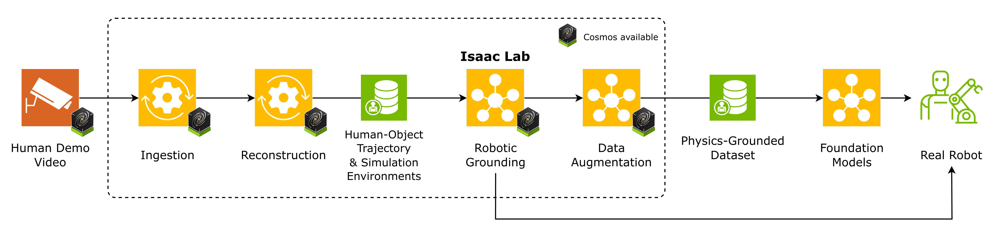

# Video to Data (V2D)

> An end-to-end pipeline that converts human demonstration videos into simulation-ready assets and physics-grounded robot training data.

**[Documentation](https://nvidia-isaac.github.io/video_to_data/)** · **[Robotic Grounding Project Page](https://nvidia-isaac.github.io/video_to_data/chord/)** · **[Robotic Grounding Tech Report](https://nvidia-isaac.github.io/video_to_data/chord/chord.pdf)**



---

## Contents

- [Overview](#overview)
- [Demos](#demos)
- [Packages](#packages)
- [Prerequisites](#prerequisites)
- [Quickstart](#quickstart)
  - [Video Ingestion Agent](#video-ingestion-agent-video--queryable-action-database)
  - [Reconstruction](#reconstruction)
  - [Robotic Grounding](#robotic-grounding-data--rl-policy)
- [Design philosophy](#design-philosophy)
- [Contributing](#contributing)

---

## Overview

Video to Data (V2D) turns raw human demonstrations into robot-ready training data through three composable stages. Each stage runs independently and writes its artifacts to disk, so you can stop, inspect, cache, and recompose the pipeline at any boundary.

1. **Video Ingestion Agent** — a LangGraph-driven agentic workflow that segments demonstration videos into temporally-bounded action clips, extracts an entity-relation scene graph, and stores per-frame SigLIP-2 embeddings. The result is a queryable action database (`graph.db` + `vector.db`) that lets downstream stages select which clips to process via natural-language retrieval, instead of brute-forcing the full video.
2. **Reconstruction** — containerized vision modules turn the selected RGB (or stereo) clips into per-frame depth, object masks, textured meshes, 6-DoF object poses, and SMPL human body parameters. Multi-view pipelines (`run_mv_hoi_reconstruction`, `run_mv_calibration`) orchestrate the full reconstruction from a rosbag.
3. **Robotic Grounding** — human motion is retargeted onto the target robot embodiment (Sharpa or G1), then the reconstructed scene and retargeted motion drive Isaac Lab environments trained with RL to produce deployable policies.

## Demos

The pipeline in action — from a raw human demonstration, to grounded policies trained in Isaac Lab, to deployment on a physical robot.

  

## Packages

| Package | Role | Runtime |
|---|---|---|
| [`video_ingestion_agent/`](video_ingestion_agent/) | Video → action segments + entity scene graph + frame embeddings. LangGraph pipeline (segment → verify/refine → entity graph → embeddings) plus an EGAgent-style natural-language retrieval agent and an optional Gradio UI. | Python venv + vLLM server |
| [`reconstruction/`](reconstruction/) | Video → depth, masks, meshes, 6D poses, human body. 18 containerized modules + multi-view pipelines. | Docker (per-module images) |
| [`robotic_grounding/`](robotic_grounding/) | RL training on NVIDIA Isaac Lab with PPO; motion retargeting utilities. **Code will be published in a later release.** | Coming soon |

## Prerequisites

- Docker with GPU support ([install](https://docs.docker.com/engine/install/ubuntu/))
- [NVIDIA Container Toolkit](https://docs.nvidia.com/datacenter/cloud-native/container-toolkit/install-guide.html)
- Python 3.10+

## Quickstart

### Video Ingestion Agent (video → queryable action database)

```bash
cd video_ingestion_agent

uv venv .venv && source .venv/bin/activate
uv pip install -e ".[all]"     # vLLM, webapp, benchmark, dev tools

# 1. Start the vLLM server (loads the VLM, ~1 minute)
python scripts/serve.py -c configs/ingestion.yaml

# 2. Ingest a video — segmentation → entity graph → report
python scripts/run_ingestion.py path/to/video.mp4 \
  -c configs/ingestion.yaml --no-verify -o runs/my_run

# 3. Retrieve clips with natural language
python scripts/run_retrieval.py "Find clips where someone picks up a mug" \
  -d outputs/ -c configs/retrieval.yaml

# 4. Or browse interactively in the web UI
python scripts/run_webapp.py
```

See [video_ingestion_agent/README.md](video_ingestion_agent/README.md) for hardware requirements, the full extras list, the verify/refine loop, and batch-ingestion across multiple GPUs. Pre-publication TODOs are tracked in [video_ingestion_agent/docs/release_readiness.md](video_ingestion_agent/docs/release_readiness.md).

### Reconstruction (video → reconstructed trajectory and simulation assets)

The [reconstruction](reconstruction) subfolder contains a variety of algorithms and pipelines for human-object reconstruction. For the initial release, we provide an example pipeline for ego-centric hand-object reconstruction — follow the setup instructions [here](reconstruction/docs/ego_e2e_setup.md).

> **Note:** The reconstruction subfolder contains a wide variety of packages, many of which are partially tested or in development. You may find these packages useful, but please note they are subject to change. The ego-centric pipeline above has been tested and is officially included as part of the initial Video to Data release. If there is a package you would like to see supported, or you have any feedback, please open an issue on GitHub.

### Robotic Grounding (reconstructed trajectory → RL policy and dataset)

The Robotic Grounding stage (motion retargeting + Isaac Lab RL training) will be publicly available in a later release. See [robotic_grounding/README.md](robotic_grounding/README.md) for an overview. The [tech report](https://nvidia-isaac.github.io/video_to_data/chord/) and [project page](https://nvidia-isaac.github.io/video_to_data/chord/) are available.

## Design philosophy

- **Host orchestration, containerized inference.** The host runs thin Python wrappers that `docker run` each module; all ML dependencies live inside their respective images. No CUDA or PyTorch is ever installed on the host.
- **Typed contracts between packages.** Modules communicate through strongly-typed dataclasses in [`v2d_common`](reconstruction/modules/v2d_common/) (`DepthImage`, `CameraIntrinsics`, `Transform3d`, `BoundingBox`, `Mask`) — never raw arrays across package boundaries.
- **File-based dataflow.** Modules write intermediate artifacts to disk (depth PNGs, pose JSONs, mask PNGs, etc.), enabling independent execution, caching, and pipeline composition via [`v2d_pipelines`](reconstruction/modules/v2d_pipelines/).

## Contributing

See the contributing guide in [reconstruction/README.md](reconstruction/README.md#contributing) for adding new reconstruction modules. Each new module must expose a Docker image, a `run_download_weights` entry point (if weights are required), a `run_shell` entry point, and a typed API surface consistent with `v2d_common`.
