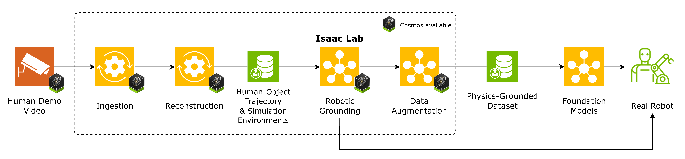
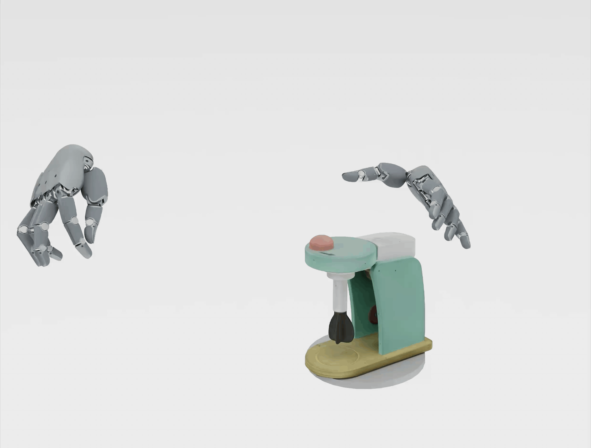

# Video to Data (V2D)

> An end-to-end pipeline that converts human demonstration videos into simulation-ready assets and physics-grounded robot training data.

**[Documentation](https://nvidia-isaac.github.io/video_to_data/)** · **[Robotic Grounding Project Page](https://nvidia-isaac.github.io/video_to_data/chord/)** · **[Robotic Grounding Tech Report](https://nvidia-isaac.github.io/video_to_data/chord/chord.pdf)**



---

## Contents

- [Overview](#overview)
- [Demos](#demos)
- [Packages](#packages)
- [Prerequisites](#prerequisites)
- [Quickstart](#quickstart)
  - [Video Ingestion Agent](#video-ingestion-agent-video--queryable-action-database)
  - [Reconstruction](#reconstruction-video--3d-data)
  - [Robotic Grounding](#robotic-grounding-data--rl-policy)
- [Design philosophy](#design-philosophy)
- [Contributing](#contributing)

---

## Overview

Video to Data (V2D) turns raw human demonstrations into robot-ready training data through three composable stages. Each stage runs independently and writes its artifacts to disk, so you can stop, inspect, cache, and recompose the pipeline at any boundary.

1. **Video Ingestion Agent** — a LangGraph-driven agentic workflow that segments demonstration videos into temporally-bounded action clips, extracts an entity-relation scene graph, and stores per-frame SigLIP-2 embeddings. The result is a queryable action database (`graph.db` + `vector.db`) that lets downstream stages select which clips to process via natural-language retrieval, instead of brute-forcing the full video.
2. **Reconstruction** — containerized vision modules turn the selected RGB (or stereo) clips into per-frame depth, object masks, textured meshes, 6-DoF object poses, and SMPL human body parameters. Multi-view pipelines (`run_mv_hoi_reconstruction`, `run_mv_calibration`) orchestrate the full reconstruction from a rosbag.
3. **Robotic Grounding** — human motion (e.g. Arctic) is retargeted onto the target robot embodiment (Sharpa), then the reconstructed scene and retargeted motion drive Isaac Lab environments trained with RSL-RL PPO to produce deployable policies.

## Demos

The pipeline in action — from a raw human demonstration, to grounded policies trained in Isaac Lab, to deployment on a physical robot.

  

## Packages

| Package | Role | Runtime |
|---|---|---|
| [`video_ingestion_agent/`](video_ingestion_agent/) | Video → action segments + entity scene graph + frame embeddings. LangGraph pipeline (segment → verify/refine → entity graph → embeddings) plus an EGAgent-style natural-language retrieval agent and an optional Gradio UI. | Python venv + vLLM server |
| [`reconstruction/`](reconstruction/) | Video → depth, masks, meshes, 6D poses, human body. 18 containerized modules + multi-view pipelines. | Docker (per-module images) |
| [`robotic_grounding/`](robotic_grounding/) | RL training on NVIDIA Isaac Lab 2.3.1 with RSL-RL (PPO); motion retargeting utilities. | Docker (`nvcr.io/nvstaging/isaac-amr`) |

## Prerequisites

- Docker with GPU support ([install](https://docs.docker.com/engine/install/ubuntu/))
- [NVIDIA Container Toolkit](https://docs.nvidia.com/datacenter/cloud-native/container-toolkit/install-guide.html)
- Python 3.10+
- NVIDIA driver 580.126.09 / CUDA 13.0 recommended (for `robotic_grounding`)

## Quickstart

### Video Ingestion Agent (video → queryable action database)

```bash
cd video_ingestion_agent

uv venv .venv && source .venv/bin/activate
uv pip install -e ".[all]"     # vLLM, webapp, benchmark, dev tools

# 1. Start the vLLM server (loads the VLM, ~1 minute)
python scripts/serve.py -c configs/ingestion.yaml

# 2. Ingest a video — segmentation → entity graph → report
python scripts/run_ingestion.py path/to/video.mp4 \
  -c configs/ingestion.yaml --no-verify -o runs/my_run

# 3. Retrieve clips with natural language
python scripts/run_retrieval.py "Find clips where someone picks up a mug" \
  -d outputs/ -c configs/retrieval.yaml

# 4. Or browse interactively in the web UI
python scripts/run_webapp.py
```

See [video_ingestion_agent/README.md](video_ingestion_agent/README.md) for hardware requirements, the full extras list, the verify/refine loop, and batch-ingestion across multiple GPUs. Pre-publication TODOs are tracked in [video_ingestion_agent/docs/release_readiness.md](video_ingestion_agent/docs/release_readiness.md).

### Reconstruction (video → 3D data)

```bash
cd reconstruction

# Install host-side orchestration wrappers (lightweight, no ML deps)
./scripts/install_pacakages.sh

# Build per-module Docker images
./scripts/build_containers.sh

# Run a minimal video→depth example (MoGe)
python -m v2d.moge.docker.run_download_weights --output_dir data/weights/moge
python -m v2d.moge.docker.run_video_to_depth \
  --video_path modules/v2d_moge/assets/test_video.mp4 \
  --depth_folder data/outputs/moge/depth \
  --intrinsics_folder data/outputs/moge/intrinsics \
  --weights_path data/weights/moge
```

Full multi-view HOI pipeline (rosbag → textured object mesh + SMPL body):

```bash
python -m v2d.pipelines.run_mv_hoi_reconstruction \
  --rosbag_path /data/rosbags/session1 \
  --output_dir  /data/datasets/session1 \
  --extrinsics_camera_params_path /data/datasets/calibration/extrinsics/edex \
  --obj_mesh_path /data/meshes/object.glb
```

See [reconstruction/README.md](reconstruction/README.md) for the complete module reference, including [Grounding DINO](reconstruction/README.md#v2d_grounding_dino), [SAM2](reconstruction/README.md#v2d_sam2), [FoundationPose](reconstruction/README.md#v2d_foundation_pose), [SAM3D-Body](reconstruction/README.md#v2d_sam3d_body), and others.

### Robotic Grounding (data → RL policy)

**Quick start:** the from-scratch setup & run guide is
[robotic_grounding/docs/SETUP.md](robotic_grounding/docs/SETUP.md) — it covers the two
Docker images, downloading each dataset from its original public source, the directory
layout, and how to run the full hand→robot retargeting pipeline.

Throughout, `<HMD>` (human-motion-data root) is a directory you choose — e.g.
`~/datasets/human_motion_data` — that holds `mano/` and one subdirectory per dataset
(`taco/`, `hot3d/`, …); see [docs/SETUP.md §4](robotic_grounding/docs/SETUP.md).

```bash
cd robotic_grounding

# One-time host setup (git-lfs, pre-commit) + robot assets (LFS)
bash workflow/setup_deps.sh
git lfs pull

# Build both pipeline images (loader + robotic-grounding) in one shot
python scripts/run_pipeline_docker.py --build-only

# Run the full pipeline on a dataset (download it first per docs/SETUP.md §6).
# <HMD> is the data root holding mano/ and each <dataset>/.
python scripts/run_pipeline_docker.py taco \
    --hmd <HMD> --mano-dir <HMD>/mano --max-sequences 2     # small smoke test
```

Reproduce the sequences end-to-end (arctic / hot3d / taco) in a self-contained
workspace — see [robotic_grounding/docs/EXAMPLE_SEQUENCES.md](robotic_grounding/docs/EXAMPLE_SEQUENCES.md)
for the sequence list and prerequisites:

```bash
HMD=<HMD> ./run_example_sequences.sh        # → RL-ready parquets under <HMD>/example_sequences/<ds>/<ds>_processed/
```

Then enter the Isaac Lab container and train a policy on the retargeted motion:

```bash
./workflow/run.sh build
./workflow/run.sh start [version] [gpu_id]              # build + enter the container
python scripts/rsl_rl/train.py --task Sharpa-V2D-v0    # inside the container
```

See [robotic_grounding/README.md](robotic_grounding/README.md) for retargeting, debug environments, and task definitions.

### Visualizer (retargeting gallery)

Browse retargeted sequences as interactive 3D animations in your browser.

See [robotic_grounding/README.md#visualizer](robotic_grounding/README.md#visualizer) for setup instructions.

## Design philosophy

- **Host orchestration, containerized inference.** The host runs thin Python wrappers that `docker run` each module; all ML dependencies live inside their respective images. No CUDA or PyTorch is ever installed on the host.
- **Typed contracts between packages.** Modules communicate through strongly-typed dataclasses in [`v2d_common`](reconstruction/modules/v2d_common/) (`DepthImage`, `CameraIntrinsics`, `Transform3d`, `BoundingBox`, `Mask`) — never raw arrays across package boundaries.
- **File-based dataflow.** Modules write intermediate artifacts to disk (depth PNGs, pose JSONs, mask PNGs, etc.), enabling independent execution, caching, and pipeline composition via [`v2d_pipelines`](reconstruction/modules/v2d_pipelines/).

## Contributing

See the contributing guide in [reconstruction/README.md](reconstruction/README.md#contributing) for adding new reconstruction modules. Each new module must expose a Docker image, a `run_download_weights` entry point (if weights are required), a `run_shell` entry point, and a typed API surface consistent with `v2d_common`.
