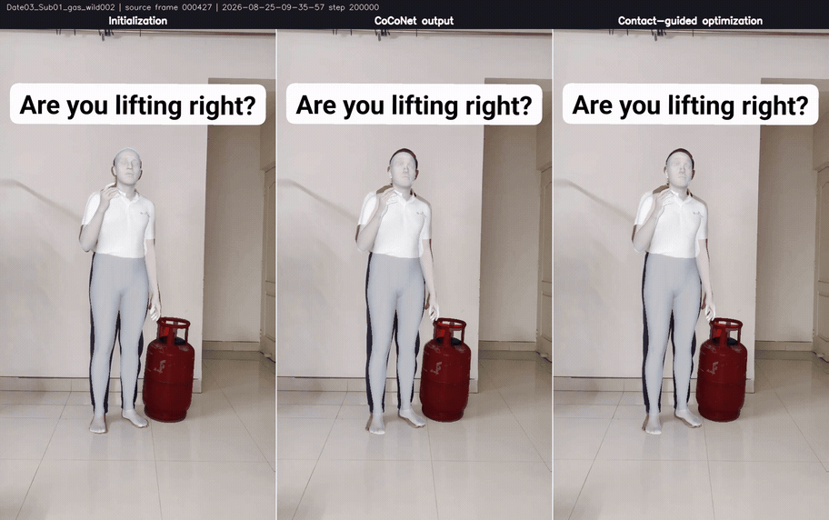

# CARI4D MHR inference and training

This module runs category-agnostic monocular human-object reconstruction from an RGB video, human/object masks, and an object mesh, and contains the native MHR CoCoNet training pipeline. Heavy inference and training code is under `lib/`; host-side Docker orchestration is under `docker/`.

## Inputs

- RGB video named `<sequence>.0.color.mp4`.
- H5 masks using `<sequence>/<frame>-k0.person_mask.png` and `<sequence>/<frame>-k0.obj_rend_mask.png` datasets.
- Textured object mesh supported by Trimesh.
- A writable, persistent weights directory.

## Prepare inputs

The RGB video, masks, and object mesh are independent inputs. CARI4D does not use the object-scanning video as its interaction video.

### Object mesh

**Released v0.3 workflow: the object mesh is provided as an input, as in the supplied test data.** For release/SQA reproduction, use that provided mesh as `--object_mesh_path`; keep any companion OBJ material and texture files together. CARI4D's inference command requires this mesh and does not generate it from the interaction video. "Monocular" describes the interaction video, not an RGB-only input contract.

#### Optional: generate a candidate mesh from one RGB frame

When no mesh is provided, the separate [SAM3D image-to-mesh tool](../v2d_sam3d/docker/run_image_to_mesh.py) can generate a candidate from a single RGB frame and its object mask. This is optional external input preparation, not an additional stage of the released CARI4D inference pipeline, and does not require a stereo capture.

First generate the masks using [Human and object masks](#human-and-object-masks) below. Select a frame where the object is clearly visible, with minimal occlusion and motion blur. Use the object mask from that exact frame at the same resolution; do not crop or resize only one of the pair. In the example below, `100` is a zero-based frame index and `1/000100.png` is the object mask under the SAM2 object-ID convention documented below. Replace both with your selected frame.

With FFmpeg available on the host, extract the full-resolution frame without changing its orientation:

```bash
ffmpeg -noautorotate -i /path/to/example.0.color.mp4 -vf "select=eq(n\,100)" -frames:v 1 /path/to/frame_000100.png
```

Request access to [facebook/sam-3d-objects](https://huggingface.co/facebook/sam-3d-objects) and set `HF_TOKEN` to a read token for an approved account. This Objects checkpoint is separate from the SAM 3D Body checkpoint used by CARI4D. From the repository root, install the host wrappers, build the SAM3D image, download its weights, and generate the mesh:

```bash
cd reconstruction
./scripts/install_packages.sh
python -m v2d.sam3d.docker.build
python -m v2d.sam3d.docker.run_download_weights --output_dir /path/to/weights/sam3d
python -m v2d.sam3d.docker.run_image_to_mesh \
  --image_path /path/to/frame_000100.png \
  --mask_path /path/to/example_sam2_masks/1/000100.png \
  --mesh_path /path/to/sam3d_mesh/object.glb \
  --transform_path /path/to/sam3d_mesh/transform.json \
  --intrinsics_path /path/to/sam3d_mesh/intrinsics.json \
  --weights_dir /path/to/weights/sam3d
```

The outputs are a generated GLB mesh and separate estimated transform/intrinsics JSON files. Inspect the geometry and establish the object's physical scale in the mesh before supplying it as `--object_mesh_path`: a single-image estimate is not a calibrated scan. CARI4D recenters/reorients the supplied geometry but preserves its scale; it does not consume these SAM3D JSON files or automatically apply their scale. Generated-mesh results are therefore not the same provided-mesh release test condition.

#### Optional: reconstruct from a separate stereo scan

If a calibrated stereo scan of the object is available, follow the [HOI object-reconstruction input and run instructions](../v2d_hoi_object_reconstruction/README.md). This requires a separate synchronized stereo capture and its calibration, not the monocular interaction video. Use `merged_recon/output.glb` from BundleSDF or `sam3d/best/output_scaled.glb` from SAM3D as `--object_mesh_path`. Skip mesh reconstruction when using the mesh already supplied with the test data.

### Human and object masks

SAM2 accepts point or box prompts and writes one mask stream per object ID. The following commands use object ID `0` for the human and object ID `1` for the manipulated object:

```bash
cd reconstruction
./scripts/install_packages.sh
python -m v2d.sam2.docker.build
python -m v2d.cari4d.docker.build
python -m v2d.sam2.docker.run_download_weights --output_dir /path/to/weights/sam2
python -m v2d.sam2.docker.run_annotate \
  --video_path /path/to/example.0.color.mp4 \
  --prompts_path /path/to/example_prompts.json \
  --port 8080
```

Open `http://localhost:8080`, add human prompts with object ID `0` and object prompts with object ID `1`, then stop the annotation server and propagate the masks:

```bash
python -m v2d.sam2.docker.run_video_to_masks \
  --video_path /path/to/example.0.color.mp4 \
  --prompts_path /path/to/example_prompts.json \
  --masks_dir /path/to/example_sam2_masks \
  --weights_dir /path/to/weights/sam2

python -m v2d.cari4d.docker.run_pack_masks \
  --video_path /path/to/example.0.color.mp4 \
  --human_masks_path /path/to/example_sam2_masks/0 \
  --object_masks_path /path/to/example_sam2_masks/1 \
  --output_path /path/to/example_masks_k0.h5
```

The packer requires the video and both mask streams to have identical frame counts, `000000`-based stems, and image dimensions. When video frame-count metadata is unavailable, the reader counts decoded frames in a streaming pass; no remuxing or re-encoding is required. Empty videos, decoder errors, and mismatched masks still fail. It writes the exact H5 keys consumed by CARI4D and fails instead of reindexing mismatched inputs.

## Hugging Face access

Complete these steps before the first inference run:

1. Sign in to [Hugging Face](https://huggingface.co/).
2. Confirm that the account can read [nvidia/cari4d_commercial](https://huggingface.co/nvidia/cari4d_commercial). This repository supplies the exact `2026-08-25-09-35-57` step-200,000 CARI4D checkpoint, its resolved configuration, and its manifest. The checkpoint SHA-256 is `78ff5cb874dd012a272382e3f2d8bc11226d5b7d0ecc739a60fbb4a97a5a5ba3` at artifact revision `1f7287ac6fd5f72c30ce2222fb345a3e7d779fc9`.
3. Request and receive access to the manually gated [facebook/sam-3d-body-dinov3](https://huggingface.co/facebook/sam-3d-body-dinov3) repository. Signing in without approval is insufficient.
4. Create a Hugging Face read token that can access both repositories and expose it to the launcher:

```bash
export HF_TOKEN=hf_your_read_token
```

The Docker launcher forwards `HF_TOKEN` into the container. W&B credentials are not required for inference.

## Run

```bash
cd reconstruction
python -m v2d.cari4d.docker.build
python -m v2d.cari4d.docker.run_inference \
  --video_path /path/to/example.0.color.mp4 \
  --mask_h5_path /path/to/example_masks_k0.h5 \
  --object_mesh_path /path/to/object.glb \
  --weights_path /path/to/weights/cari4d \
  --output_dir /path/to/output \
  --expected_frames 1209
```

The gas-tank validation sequence has 1,209 frames. Set `--expected_frames` to the exact frame count for another input; omit it only when no external frame-count contract is available.

Unless `--skip_weight_download` is specified, the command downloads the pinned CARI4D, SAM 3D Body, MoGe 2, DINOv2, DINOv3, and FoundationPose artifacts before stage 1. It stores them under `--weights_path` and verifies the CARI4D checkpoint SHA-256 and manifest identity. Keep this directory persistent so Hugging Face can reuse matching files after the first run. The current container includes the validated FoundationPose path compatibility and pins `transformers==5.3.0`; no task-local source patch or dependency overlay is required.

An HTTP 401 or 403 response indicates that the token is missing, lacks read permission, or belongs to an account without repository approval. After one successful download, offline runs can add `--skip_weight_download`; all required files must already be present because missing or mismatched weights fail explicitly.

## Pipeline

1. Batched MoGe 2 metric-shape depth initialization.
2. RGB, mask, intrinsics, and aligned object-mesh export.
3. SAM 3D Body human initialization from the SAM2-derived bbox and mask.
4. Monocular-depth scale alignment to the initialized human.
5. FoundationPose registration on the first usable frame and tracking thereafter.
6. CoCoNet inference with checkpoint-embedded supervision metadata. Observed and initialized XYZ are centered on MHR root joint 1 and scaled so the neutral initialized human height is 2 m; predicted human and object translation updates are converted back to metric space.
7. Full-clip contact-guided refinement for 300 steps with temporal weight `100` and human-pose-prior weight `200`. A network-predicted hand contact is activated only when its raw CoCoNet hand-surface distance to the object is strictly below 0.05 m; this geometric gate is computed once before refinement and remains fixed.
8. Video rendering for both the final reconstruction and a frame-ID-labeled three-stage comparison. The object retains its original texture; the human uses constant `#C8D2D8` albedo with normal-based diffuse shading.

Each stage writes an input/output identity marker under `<output>/<sequence>/.stages`. An unchanged rerun reuses validated outputs; changed inputs require `--overwrite`.

Stage 8 writes both videos with H.264 video and `yuv420p` pixel format:

- `<sequence>_step200000_reconstruction.mp4`: source RGB beside the final refined mesh on a `#202428` background.
- `<sequence>_step200000_before_after.mp4`: initialization, CoCoNet prediction, and contact-guided refinement overlaid on RGB, with the source frame ID displayed above the three panels. For a 608x1080 gas-tank input, this comparison is 1824x1164 and contains exactly 1,209 frames.



Stage 6 always invokes CoCoNet with the internal `--offline-supervision-contract` flag and never supplies `--wandb-run-path`. These are internal inference-runner flags, not public `run_inference` or training CLI options.

## Validation

### Full acceptance suite (Docker)

Use this command for SQA acceptance. From `reconstruction/`, with the host packages installed, build the CARI4D image and run the complete suite through the host wrapper:

```bash
python -m v2d.cari4d.docker.build
python -m v2d.cari4d.docker.run_tests
```

The wrapper runs `python -m pytest tests -v` inside Docker, including the host-safe checks, `test_runtime_contract.py`, and the spatial and training-data runtime contracts. The image supplies PyTorch, NumPy, HDF5 (`h5py`), OpenCV, and pytest. The acceptance condition is all collected tests passing with no failures or skips; do not pin the expected count because coverage can increase.

### Source contracts only (host)

`test_contract.py` checks source-level contracts using only the Python standard library. It can also run directly in the lightweight host virtual environment with pytest installed. From `reconstruction/`:

```bash
python -m pip install pytest==9.1.1
python -m pytest modules/v2d_cari4d/tests/test_contract.py -v
```

Equivalently, from `reconstruction/modules/v2d_cari4d/`, run `python -m pytest tests/test_contract.py -v`. This is a smaller source-only check, not a replacement for the full acceptance suite. Array, tensor, rendering, and HDF5 checks are kept in `test_runtime_contract.py` and still run in Docker; no runtime checks are skipped based on installed packages.

Do not install PyTorch or `h5py` into `reconstruction/.venv` to run the full suite. If an older checkout reports `ModuleNotFoundError` for either dependency while collecting `test_contract.py`, use `python -m v2d.cari4d.docker.run_tests` from `reconstruction/`. The test wrapper mounts the current `modules/` tree, so test-only changes do not require rebuilding an already current image.

## Training

Training data remains on external storage and is not included in this repository. The checked-in production configuration targets the 2,126-sequence commercial Daniel `data_export_3` corpus generated with MoGe 2 and the 79-sequence BEHAVE validation set. The promoted `2026-08-25-09-35-57` checkpoint uses a constant `0.000125` learning rate. The final training index contains 39,965 temporal windows and 159,838 camera samples, with SHA-256 `2194f62cf837515d3d45030e9fdf3e7bcf2bcd8f1964184503baa5161fd54654`.

Every training window requires usable canonical effective masks for all 96 sampled frames and every sampled camera. Required sidecars are identity-checked and missing or stale sidecars fail explicitly. At least 10 of 96 canonical object masks must be nonempty in every sampled camera. Packed training data must also carry the `mhr-hand-surface-contact-v1` hand-to-object triangle-surface contact schema; legacy wrist-distance labels cannot be published or consumed as contact supervision.

```text
lib/cari4d/learning/configs/mhr-daniel-commercial-moge2-behave79-val-fp16.yml
```

Build the persistent trim-aware indexes once after overriding the dataset roots for the current environment:

```bash
cd /workspace/v2d_cari4d/lib/cari4d
python scripts/build_mhr_dataset_index.py \
  --config learning/configs/mhr-daniel-commercial-moge2-behave79-val-fp16.yml \
  --train-output /path/to/indexes/train.pkl \
  --val-output /path/to/indexes/val.pkl
```

Then launch distributed training inside an allocated multi-GPU container. The launcher uses one timestamp for the experiment name and W&B run ID unless they are explicitly supplied:

```bash
python -m v2d.cari4d.lib.run_training \
  --num-processes 8 \
  --override mhr_dataset_index_path=/path/to/indexes/train.pkl \
  --override val_mhr_dataset_index_path=/path/to/indexes/val.pkl
```

Use `--no-wandb` for smoke tests. Resume launches must pass the original `--exp-name` and `--run-id`; the trainer restores checkpoint-bound supervision, augmentation, spatial-normalization, window-sampling, and FoundationPose-tier contracts before continuing.
