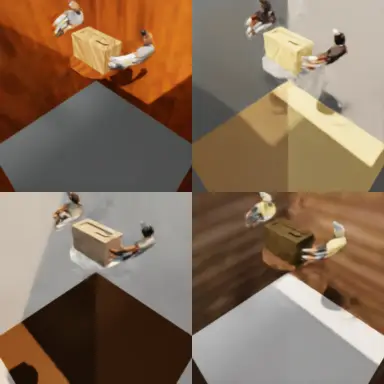

# Robotic Grounding

> 📐 **New here?** See [`docs/ARCHITECTURE.md`](docs/ARCHITECTURE.md) for the architecture, contents map, and where-to-find-what guide.

## Prerequisites

- Install [Docker](https://docs.docker.com/engine/install/ubuntu/) and [post-installation](https://docs.docker.com/engine/install/linux-postinstall/#manage-docker-as-a-non-root-user) steps.

- Install [NVIDIA Container Toolkit](https://docs.nvidia.com/datacenter/cloud-native/container-toolkit/latest/install-guide.html).

- Make sure you have access to `nvcr.io/nvstaging/isaac-amr`. You can request it by asking in the `#swngc-help` Slack channel.

- Install Git LFS and `pre-commit` dependencies.
    ```bash
    bash workflow/setup_deps.sh
    ```
    This script installs `git-lfs` and `pre-commit` and ensures `workflow/run.sh` is executable. You may need to restart your shell for pipx PATH changes.

- A host Python environment for the pipeline orchestrator (`scripts/run_pipeline_docker.py`).
    ```bash
    python3 -m venv ~/venvs/v2d
    source ~/venvs/v2d/bin/activate
    cd <repo>/reconstruction
    pip install -e modules/v2d_common -e modules/v2d_docker -e modules/v2d_task_library_loader/docker
    ```
    The orchestrator itself has no ML dependencies, but `--build` / `--build-only` runs
    `pip install -e` for the loader packages into whichever interpreter launched it — so give it a
    venv instead of system Python. Activating it also makes the bare `python` in the **host**
    commands below resolve; a stock Ubuntu host ships only `python3` and otherwise fails with
    `python: command not found`. This applies only to host commands: **inside** the container
    `python` is the Isaac wrapper and no venv is involved ([docs/SETUP.md §9](docs/SETUP.md)).

- NVIDIA Driver Version 580.126.09, CUDA Version: 13.0 Recommended. In case of visualization errors, check NVIDIA driver version.

## Environment & Credentials

`<HMD>` (human-motion-data root) used below is a directory you choose — e.g.
`~/datasets/human_motion_data` — that holds `mano/` and one subdirectory per dataset
(`taco/`, `hot3d/`, …); see [docs/SETUP.md §4](docs/SETUP.md) for the full layout.

You download every dataset yourself from its **original public source**. You should provide the
license-gated assets you register for yourself:

- **MANO hand models** (required by the `load` stage). Register and accept the license at
  [mano.is.tue.mpg.de](https://mano.is.tue.mpg.de/), download `mano_v1_2.zip`, and place the two
  `.pkl` files at `<HMD>/mano/models/MANO_LEFT.pkl` and `<HMD>/mano/models/MANO_RIGHT.pkl`
  (see [docs/SETUP.md §5](docs/SETUP.md)). MANO is never committed and is read only at load time.
- **Datasets** — each has its own registration/download portal. Follow the per-dataset guide in
  [docs/SETUP.md §6](docs/SETUP.md) (taco, hot3d, arctic, grab, h2o, dexycb) to download and lay
  the data out under `<HMD>/<dataset>/`.

Pass the MANO directory at runtime with `--mano-dir <HMD>/mano`.

## Docker Usage

Development should be **inside** the Container, and Git operations should be done **outside** the Container on the host machine.

Every command block below is labelled `# From the host` or `# Inside the container`. Host blocks
need the venv from [Prerequisites](#prerequisites); in-container blocks do not — there `python` is
the Isaac wrapper, so use `python` and never `python3`.

```bash
# From the host
./workflow/run.sh build [version] # Build Docker image and tag it with [version]
./workflow/run.sh start [version] [gpu] # Run and enter the Container with specific version and GPU
./workflow/run.sh shell [version] [gpu] # Enter Container from new shell with specific version and GPU
./workflow/run.sh stop [version] [gpu] # Stop the Container with specific version and GPU
```

## Development

You can launch the container with commands in the Docker Usage section.

If using VSCode or Cursor, you can use the `Attach to Running Container` feature in Dev Containers extension by `command/ctrl + shift + p`.  Inside the container, you can use Python interpreter `/workspace/isaaclab/_isaac_sim/python.sh` for debugging. The working directory is `/workspace/video_to_data/robotic_grounding`.

Currently, due to Isaac Lab's image requiring root for Omniverse, we are using the root user for the container. There can be some permission issues, but they can be bypassed with `sudo chown -R $(whoami) .` in the host machine.

For agent-oriented checks, use this quick path before opening a merge request. Commands assume the `robotic_grounding/` package root, and Isaac commands should run inside the container. OSMO and W&B are not required for the local smoke tests below.

## Agent Smoke Tests

### Assets and dummy agent

| Floating hands — Sharpa | Whole body — ReconHand | Whole body — ReconBody |
| :---: | :---: | :---: |
|  |  |  |
| *Box grab, zero-action dummy agent* | *Espresso use, zero-action dummy agent* | *Whole-body pick, zero-action dummy agent* |

Motion data resolves under `source/robotic_grounding/robotic_grounding/assets/human_motion_data/`. The safest local shorthand is `<dataset>/<dataset>_processed/<sequence_id>/sharpa_wave`, for example `arctic/arctic_processed/dataset_s07_box_grab_01/sharpa_wave`.

Generate the retargeted motion + object assets by running the pipeline on a dataset you
downloaded per [docs/SETUP.md](docs/SETUP.md):

```bash
# From the host — builds the right image per stage (load → urdf → processed → support).
# --sequence-pattern pins the exact sequence the smoke tests below reference; swap it for
# --max-sequences N to instead sample the first N sequences in filesystem order.
source ~/venvs/v2d/bin/activate   # host venv from Prerequisites
python scripts/run_pipeline_docker.py arctic \
  --hmd <HMD> --mano-dir <HMD>/mano --sequence-pattern s07_box_grab_01
```

This writes the RL-ready `dataset_s07_box_grab_01` parquet to
`<HMD>/arctic/arctic_processed/...` and the object URDFs/meshes to
`<HMD>/arctic/object_assets/`. The `--motion_file` shorthand below resolves under the
in-container `assets/human_motion_data/`, so start the container with your dataset root
`<HMD>` mounted there (from the host):

```bash
# From the host
HUMAN_MOTION_DATA_DIR=<HMD> ./workflow/run.sh start latest 0
```

Each direct dataset subdirectory under `<HMD>` is mounted separately under
`assets/human_motion_data/`, so external data such as `arctic/arctic_processed/…` resolves
without hiding repository datasets such as `whole_body/`. If `<HMD>` contains a directory
with the same dataset name as a repository dataset, the external directory takes precedence
for that dataset. Alternatively, pass an absolute path to `--motion_file`.

Stages that load real object geometry — retargeting, kinematic replay, support-surface
reconstruction, scene view, and training — need the object assets present. The pipeline's
`urdf` stage generates them; to (re)generate them standalone from already-downloaded
meshes, run `python scripts/generate_rigid_urdfs.py --dataset <dataset>` inside the container. See
[workflow/data_pipeline.md](workflow/data_pipeline.md#object-assets-urdfs--meshes).

(The `--use_primitive_urdfs` dummy-agent smoke test below does not need them.)

Run a GUI dummy-agent smoke test inside the container:

```bash
# Inside the container
python scripts/rsl_rl/dummy_agent.py \
  --task Sharpa-V2D-v0-Play \
  --motion_file arctic/arctic_processed/dataset_s07_box_grab_01/sharpa_wave \
  --num_envs 1 \
  --use_primitive_urdfs
```

Run the same check headless with a short MP4:

```bash
# Inside the container
python scripts/rsl_rl/dummy_agent.py \
  --headless \
  --task Sharpa-V2D-v0-Play \
  --motion_file arctic/arctic_processed/dataset_s07_box_grab_01/sharpa_wave \
  --num_envs 1 \
  --use_primitive_urdfs \
  --record_video \
  --output_dir /tmp/rg_dummy_agent_video \
  --video_length 300
```

Success means Isaac starts, the task registers, `SceneConfig.from_motion_file` loads the parquet partition, no missing-asset exception is raised, and the simulation advances.

For the whole-body **ReconHand** env, point the same script at a planned `g1_dex3`
partition (produced by [Retargeting](#retargeting) → [Whole-body planning](#whole-body-planning)).
Zero actions feed the SONIC decoder, so this is an open-loop replay of the planned motion —
a quick check that the Dex3 robot, articulated object, and support surface spawn:

```bash
# Inside the container
python scripts/rsl_rl/dummy_agent.py \
  --task SonicG1-ReconHand-v0 \
  --motion_file arctic/planner_processed/dataset_s09_espressomachine_use_02/g1_dex3 \
  --num_envs 1
```

### Training

Use the [RL training](#rl-training) section below for a local `train.py` one-iteration smoke test. If W&B is not configured, keep local smoke tests on TensorBoard by passing `--logger tensorboard`.

## Retargeting

| Floating hands — Sharpa | Floating hands — Dex3 | Whole body — G1 |
| :---: | :---: | :---: |
|  |  |  |
| *Box-grab retargeting in Viser* | *Espresso-use retargeting in Viser* | *Whole-body retargeting in Viser* |

The full hand→robot retargeting pipeline is driven from the **host** by
`scripts/run_pipeline_docker.py`, which runs each stage in the right Docker image
(`load → urdf → processed → support → vis`). First download a dataset from its original
public source — see **[docs/SETUP.md](docs/SETUP.md)** — and lay it out under `<HMD>/<dataset>/`.

### Hand-only (Sharpa)
```bash
# From the host — all three commands, from the venv in Prerequisites:
source ~/venvs/v2d/bin/activate

# Build the two images once (loader + robotic-grounding):
python scripts/run_pipeline_docker.py --build-only

# Run the pipeline on a downloaded dataset (e.g. arctic). --sequence-pattern pins the one
# sequence the RL examples use; retargeted parquets land in
# <HMD>/arctic/arctic_processed/sequence_id=dataset_s07_box_grab_01/robot_name=sharpa_wave/.
# (Drop it for --max-sequences N to sample the first N sequences instead.)
python scripts/run_pipeline_docker.py arctic \
    --hmd <HMD> --mano-dir <HMD>/mano --sequence-pattern s07_box_grab_01

# Visualize a retargeted result (viser HTML / MP4):
python scripts/run_pipeline_docker.py arctic --hmd <HMD> --mano-dir <HMD>/mano --stages vis
```

The `load` stage (MANO forward-kinematics) runs in the separate `v2d_task_library_loader`
image and produces the `{dataset}_loaded` Parquet that the retarget step consumes; the
orchestrator handles both images for you. To run the stages manually inside the container
instead (Pattern B: `run_load_local.sh` + `run_retarget_local.sh`), or to retarget a single
dataset script (`scripts/retarget/<dataset>_to_sharpa.py`, `scripts/retarget/vis_retargeted.py`),
see [docs/SETUP.md §4](docs/SETUP.md).

### Ego video → Sharpa

The `ego_recon` dataset retargets a **monocular egocentric video reconstruction** to the
dual-hand Sharpa robot. Unlike the multi-view datasets above, its source is a `result.npz`
bundle produced by the upstream ego reconstruction pipeline, which lives outside this repo.
That bundle is converted to the standard loaded Parquet by the loader image, and this repo
picks it up from there.

Its storage layout differs from the other datasets in two ways. It drops the redundant dataset
prefix — `ego_recon/processed/`, not `ego_recon/ego_recon_processed/` — via the
`processed_dir` override on `DatasetConfig`. And it keeps **every per-sequence artifact in that
one directory**: the motion Parquet, the object mesh and material, the generated collision STL
and the rigid URDF, with no separate `meshes/` or `urdfs/` tree. A clip is therefore
self-contained and moves as a unit.

Its loaded Parquet is the exception, and deliberately so. For the other datasets
`HUMAN_MOTION_DATA_DIR` is an external mount, so intermediates never touch the repo; ego_recon's
assets are committed, so a regenerable intermediate written there would be repo noise. It goes to
`robotic_grounding/.cache/ego_recon/loaded/` instead (gitignored), via
`DatasetConfig.loaded_in_intermediate`. Override the root with `ROBOTIC_GROUNDING_INTERMEDIATE_DIR`.
Support surfaces are *not* affected — they are a committed artifact that `SceneConfig` discovers
relative to the processed motion path, so they stay in the asset tree.

One worked sequence (`tissue_box_simple`) ships **retargeted**, so training is reproducible
from repo contents alone. The loaded Parquet is not committed, so re-running the retarget or
support-surface steps below requires generating it first via the reconstruction load workflow.

```bash
# Inside the container, from robotic_grounding/. Writes
# <HMD>/ego_recon/processed/sequence_id=<seq>/robot_name=sharpa_wave/.
# Needs <HMD>/ego_recon/loaded/ — see the note above.
# Drop --save for a dry run; add --visualize to inspect the IK in viser.
python scripts/retarget/ego_recon_to_sharpa.py --sequence_id <seq> --save

# Generate the rigid object URDF and reconstruct the support surface:
python scripts/generate_rigid_urdfs.py --dataset ego_recon
python scripts/reconstruct_support_surfaces.py --dataset ego_recon --sequence_id <seq>

# Inspect a retargeted result on http://localhost:8080. --start_paused opens the Frame
# slider paused so you can scrub; the frame indices feed motion_start_frame /
# motion_end_frame (end is exclusive). Reads the shipped Parquet, so it works out of the box:
python scripts/retarget/vis_retargeted.py \
    --dataset ego_recon --sequence_id tissue_box_simple --start_paused
```

Three properties of monocular reconstruction shape this path and are worth knowing before you
retarget your own clip:

- **Fingers routinely start inside the object.** Per-frame IK alone cannot resolve this, so
  penetrating MANO keypoints are first projected onto the object's oriented bounding box
  (`retarget/object_collision.py`), which preserves finger and hand rigidity.
- **Contact positions and normals are noisy**, which makes the default
  `contact_wrench_support_reward` a poor training signal. The `force_closure` reward exists
  for this case — see [RL training](#rl-training).
- **Gravity alignment can carry a residual tilt**, leaving the object resting on an edge
  rather than a face. Check it with the *contact footprint*: take the object's mesh vertices
  within 5 mm of its lowest world z at a rest frame. A face-down box gives a broad planar
  patch; a thin strip means the world is tilted. Neither loader flag reliably fixes this —
  `--no_ground_align` keeps the tilt, and the loader's OBB path picks "up" by smallest PCA
  extent, which is arbitrary when a box's two smaller extents are close. Level the bundle
  once instead, with `v2d.task_library_loader.lib.level_result_bundle`, then load it with
  `--no_ground_align`. The shipped `tissue_box_simple` needed an 8.4 degree correction.

### Hand-to-Dex3 (ReconHand)

Retarget a hand-object clip to the Dex3 hands for the whole-body planner. Consumes the
`{dataset}_loaded` MANO parquet from the `load` stage above and writes
`<output_dir>/sequence_id=<seq>/robot_name=dex3/`. Scale defaults to 1.0 (arctic) / 1.2 (taco).

```bash
# Inside the container
DATA=source/robotic_grounding/robotic_grounding/assets/human_motion_data

# arctic (e.g. espresso)
python scripts/retarget/arctic_to_dex3.py \
  --input_dir $DATA/arctic/arctic_loaded --output_dir $DATA/arctic/arctic_dex3 \
  --sequence_id dataset_s09_espressomachine_use_02 --device cuda:0 --save

# taco
python scripts/retarget/taco_to_dex3.py \
  --input_dir $DATA/taco/taco_loaded --output_dir $DATA/taco/taco_dex3 \
  --sequence_id taco_skim_off__spoon__pan_20230926_011 --device cuda:0 --save
```

Next: [Whole-body planning](#whole-body-planning) turns this into a G1 trajectory.

### Whole-body (SOMA → G1)
```bash
# Inside the container
# Retarget and save Parquet (data_folder must contain soma_params.npz, poses.npy, and
# reconstructed_mesh/output_aligned.glb; object/textured_mesh.obj is generated on first run)
python scripts/retarget/soma_to_g1.py <data_folder> --save

# Visualize retargeting in Viser (port 8080)
python scripts/retarget/soma_to_g1.py <data_folder> --visualize
```

### Kinematic replay (all schemas)
Replay retargeted motion in Isaac Lab. Supports both whole-body (G1) and dual floating-hand (Sharpa/Dex3) data.
Robot and object are teleported kinematically — no physics forces act on them.
```bash
# Inside the container
# Replay G1 retargeted data (loops by default)
python scripts/replay_motion.py \
    --motion_file source/robotic_grounding/robotic_grounding/assets/human_motion_data/whole_body/soma/sequence_id=<seq>/robot_name=g1

# Replay hand-only data
python scripts/replay_motion.py \
    --motion_file source/robotic_grounding/robotic_grounding/assets/human_motion_data/arctic/arctic_processed/sequence_id=<seq>/robot_name=sharpa_wave

# Options
python scripts/replay_motion.py --motion_file <path> --speed 0.5   # Slow motion
python scripts/replay_motion.py --motion_file <path> --no-loop     # Stop at last frame
python scripts/replay_motion.py --motion_file <path> --headless    # No GUI
```

### Support surface reconstruction
Detect where objects rest on surfaces above the ground plane and generate collision geometry for RL training.
```bash
# Inside the container
# For hand-only datasets (auto-detects schema)
python scripts/reconstruct_support_surfaces.py --input_dir <loader_output_dir> --sequence_id <seq>

# For G1 whole-body retargeted data
python scripts/reconstruct_support_surfaces.py --input_dir source/robotic_grounding/robotic_grounding/assets/human_motion_data/whole_body/soma --sequence_id <seq>

# Or use the dataset shortcut
python scripts/reconstruct_support_surfaces.py --dataset soma_g1 --sequence_id <seq>
```

Objects resting on the ground are automatically filtered out (threshold configurable via `--ground_threshold`).

### Scene viewer (static spawn verification)
```bash
# Inside the container
python scripts/view_scene.py --motion_file <parquet_partition_path>
```

## Whole-body planning

The planner turns a Dex3 EE trajectory (from [Hand-to-Dex3](#hand-to-dex3-reconhand)
retargeting) into a whole-body G1 reference for the `SonicG1-ReconHand-*` envs. Run it
inside the container from `robotic_grounding/`. `--output $DATA/<dataset>` writes the plan
under the dataset dir (beside `object_assets/` and `reconstructed_stage/`) so it trains in
place — no copy step.

```bash
# Inside the container
DATA=source/robotic_grounding/robotic_grounding/assets/human_motion_data

python -m robotic_grounding.planner.g1_planner --robot dex3 \
  --v2d_parquet $DATA/arctic/arctic_dex3 --v2d_robot_name dex3 \
  --v2d_sequence dataset_s09_espressomachine_use_02 \
  --v2d_start_at_first_contact --v2d_pre_contact_frames 23 \
  --v2d_end_after_last_contact_frames 7 --target_fps 100 \
  --workspace_offset -0.10 0.0 -0.05 --heading_align_frame first_contact \
  --output $DATA/arctic --no_viewer
```

Writes `arctic/planner_processed/sequence_id=<seq>/robot_name=g1_dex3/` and
`arctic/reconstructed_stage/<seq>_support.usda`. Planner flags are tuned per sequence; see
[`v2d_whole_body/EXAMPLE_SEQUENCES.md`](source/robotic_grounding/robotic_grounding/tasks/v2d_whole_body/EXAMPLE_SEQUENCES.md)
for all three example sequences and the three-stage training recipe.

## RL training

| Floating hands — Sharpa | Whole body — ReconHand | Whole body — ReconBody |
| :---: | :---: | :---: |
|  |  |  |
| *Box-grab trained-policy rollout* | *Espresso-use trained-policy rollout* | *Whole-body trained-policy rollout* |

Commands in this section assume you are inside the container from the
`robotic_grounding/` package root, started with your data mounted (as in
[Assets and dummy agent](#assets-and-dummy-agent) above):

```bash
# From the host
HUMAN_MOTION_DATA_DIR=<HMD> ./workflow/run.sh start latest 0
```

### Smoke tests

Short runs that verify the env builds, assets load, and training steps — no W&B
or OSMO needed when the motion data is present locally. Keep them on
`--logger tensorboard`.

```bash
# Inside the container
# Run a real one-iteration train smoke test.
python scripts/rsl_rl/train.py \
  --headless \
  --task Sharpa-V2D-v0 \
  --motion_file arctic/arctic_processed/dataset_s07_box_grab_01/sharpa_wave \
  --num_envs 1 \
  --max_iterations 1 \
  --logger tensorboard \
  --run_name smoke_train \
  --use_primitive_urdfs \
  agent.num_steps_per_env=8 \
  agent.save_interval=1

# Evaluate the checkpoint produced by the smoke train.
CHECKPOINT=$(find logs/rsl_rl -path '*smoke_train*/model_*.pt' | sort -V | tail -1)
python scripts/rsl_rl/eval.py \
  --headless \
  --task Sharpa-V2D-v0 \
  --motion_file arctic/arctic_processed/dataset_s07_box_grab_01/sharpa_wave \
  --num_envs 1 \
  --checkpoint "$CHECKPOINT" \
  --use_primitive_urdfs

# Whole-body (ReconHand) eight-iteration train smoke, stage-1 recipe
# (see Retargeting -> Whole-body planning)
python scripts/rsl_rl/train.py \
  --headless \
  --task SonicG1-ReconHand-Stage1-v0 \
  --motion_file arctic/planner_processed/dataset_s09_espressomachine_use_02/g1_dex3 \
  --num_envs 256 \
  --max_iterations 8 \
  --zero-actor \
  --logger tensorboard \
  --run_name recon_espresso_smoke

# Whole-body (ReconBody / TPV) eight-iteration train smoke
python scripts/rsl_rl/train.py \
  --headless \
  --task SonicG1-ReconBody-v0 \
  --motion_file whole_body/soma/2026-03-06_10-24-18_snack_box_pick_and_place_01/g1 \
  --num_envs 256 \
  --max_iterations 8 \
  --zero-actor \
  --logger tensorboard \
  --run_name recon_body_snack_box_smoke

# Other entry points.
python scripts/rsl_rl/dummy_agent.py  # Run an environment with zero actions.
python scripts/rsl_rl/eval.py         # Evaluate a trained checkpoint and export policy.
```

See the `Agent Smoke Tests` section above for the required asset layout and dummy-agent commands.

### Full training

Full training uses the real object assets (the pipeline's `urdf` stage). Drop
the smoke overrides (`--num_envs 1`,
`--max_iterations 1`, `--use_primitive_urdfs`, `agent.num_steps_per_env`,
`agent.save_interval`) and let each task's PPO cfg drive iterations and batching.

Floating-hand (Sharpa):
```bash
# Inside the container
python scripts/rsl_rl/train.py \
  --headless --task Sharpa-V2D-v0 \
  --motion_file arctic/arctic_processed/dataset_s07_box_grab_01/sharpa_wave \
  --num_envs 4096 --logger tensorboard --video --run_name box_grab
```

Whole-body ReconBody / TPV (retarget SOMA first via [Retargeting](#retargeting);
more in the [whole-body task README](source/robotic_grounding/robotic_grounding/tasks/v2d_whole_body/README.md#running)):
```bash
# Inside the container
python scripts/rsl_rl/train.py \
  --headless --task SonicG1-ReconBody-v0 \
  --motion_file whole_body/soma/2026-03-06_10-24-18_snack_box_pick_and_place_01/g1 \
  --num_envs 4096 --logger tensorboard --video --run_name recon_body_snack_box
```

Whole-body ReconHand — the three-stage retarget → plan → train recipe
(warm-up → contact grounding → finetune), documented per sequence in
[`v2d_whole_body/EXAMPLE_SEQUENCES.md`](source/robotic_grounding/robotic_grounding/tasks/v2d_whole_body/EXAMPLE_SEQUENCES.md).

#### Ego-video (monocular) sequences — the force-closure recipe

Reconstructions from a single egocentric camera carry noisy contact positions and normals, so
`contact_wrench_support_reward` — which matches the *live* contact geometry against the
*reference* geometry — trains against noise. The `force_closure` reward replaces it: it gates
on the reference "contact expected" label and rewards the fraction of live wrench-basis
directions the hand actually supports, so it never reads the noisy reference geometry.

```bash
python scripts/rsl_rl/train.py \
  --headless --task Sharpa-V2D-v0 \
  --motion_file ego_recon/processed/tissue_box_simple/sharpa_wave \
  --num_envs 4096 --logger tensorboard --video --run_name tissue_box_simple \
  env.rewards.force_closure.weight=5.0 \
  env.rewards.contact_wrench_support_reward.weight=0.0 \
  env.rewards.unintended_contact_penalty.weight=0.0 \
  env.rewards.missed_contact_penalty.weight=0.0 \
  env.curriculum.fixed_timestep_curriculum.params.rewards_contact_wrench_support_reward=0.0 \
  env.curriculum.fixed_timestep_curriculum.params.rewards_unintended_contact_penalty=0.0 \
  env.curriculum.fixed_timestep_curriculum.params.rewards_missed_contact_penalty=0.0
```

> **Each contact term must be zeroed in BOTH places.** A reward weight has two independent
> sources, and overriding only one leaves the term live for part of training:
>
> - `env.rewards.<name>.weight` is the value in force **from step 0** until the curriculum
>   first writes.
> - `env.curriculum.fixed_timestep_curriculum.params.rewards_<name>` is what
>   `FixedTimestepCurriculum` writes **on schedule**, overwriting whatever is there.
>
> With main's schedule the first curriculum step lands at 2000 × `num_steps_per_env` (24) =
> **48,000 sim steps**, so zeroing only the curriculum params leaves the contact terms at full
> strength (10.0 / −10.0 / −1.0) for the whole early phase — exactly where grasp behaviour is
> established. `force_closure` has no `rewards_*` param, so its weight override alone is stable.

Virtual object control needs no override: the curriculum's existing
`virtual_object_control_scale_factor` schedule already decays 1.0 → 0.0 across training.

To confirm the weights are what you intended, check the **Active Reward Terms** table Isaac
prints at startup — it shows the `env.rewards.*` values in force at step 0. A silent overwrite is
otherwise invisible until the policy fails to grasp.

To run the same recipe on OSMO, pass these overrides through the training command in
`workflow/train.yaml` and submit with `scripts/run_osmo.py --build-image`. The image build is
required: the motion parquet, mesh, collision STL and URDF are committed under
`assets/human_motion_data/ego_recon/processed/` and are read from the image at runtime.

## Data Generation

Roll out trained per-sequence Sharpa policies in the `Sharpa-V2D-Record-v0` env (front +
egocentric `TiledCamera`s, cubicle walls, `RecorderManager`) and export a **LeRobot v3**
dataset of camera + state/action observations. Runs inside the container from
`/workspace/video_to_data/robotic_grounding`.

```bash
# One sequence -> LeRobot dir datasets/<run>/<seq>/
python scripts/rsl_rl/record_dataset.py --headless \
  --task Sharpa-V2D-Record-v0 \
  --checkpoint ../Datagen_Checkpoints/floating_sharpa_checkpoints/taco/<seq>/model_<iter>.pt \
  --motion_file taco/taco_processed/<seq>/sharpa_wave \
  --num_envs 64 --num_episodes 100 \
  --voc_scale 0.0 --voc_decay_steps 20 \
  --use_primitive_urdfs \            # REQUIRED: taco checkpoints are trained on primitive URDFs
  --domain_randomization \           # optional: per-episode visual DR (materials/lighting)
  --output_file datasets/<run>/<seq>.hdf5
```

- **`--use_primitive_urdfs` is required** for the taco checkpoints (trained with primitive
  capsule/cylinder hand collision); recording on the full mesh URDF makes grasps slip and
  completion collapse.
- **VOC:** `--voc_scale` is the value virtual-object-control decays *to* after
  `--voc_decay_steps` steps (`0.0` = assist then release — usual for a behaviour dataset).
- **Output** is LeRobot v3 by default (`--output_format hdf5` for raw HDF5).
- **`--domain_randomization`** randomizes rendered pixels only (materials/lighting/support),
  not the policy's state observations — no effect on completion, adds image diversity.

**All checkpoints (batch):** `scripts/batch_taco_datagen.py` (env-overridable `NUM_ENVS`,
`NUM_EPISODES`, `USE_PRIMITIVE_URDFS=1`, `DOMAIN_RANDOMIZATION`, `RUN_TIMEOUT`) runs every
sequence and writes `SUMMARY.md` (per-task + total completion vs checkpoint metadata).
`scripts/launch_sharded_datagen.sh N` runs N containers in parallel for ~N× speedup.

**Inspect:** `scripts/visualize_dataset.py --dataset <lerobot_dir> --output_dir <dir>` tiles
per-episode camera videos; `scripts/test_lerobot_format.py <dir>` validates the export.

See `.claude/skills/sharpa-datagen/` for the full guide (data requirements, env sizing,
troubleshooting).

## Visual domain randomization

| Four re-rendered demos of the *same* trajectory |
| :---: |
|  |
| *`rerender_demo_visuals.py --num_demos 4`. Hand and box move in lockstep — the state/action arrays are bit-identical — while ground, walls, table, object and lighting differ per demo.* |

`Sharpa-V2D-DR-v0` and `Sharpa-V2D-DR-Record-v0` add visual DR as IsaacLab `EventTerm`s:
HDRI dome light, distant key light, and textures on the ground, object, support surface,
cubicle walls and both hands. Because the terms run inside the manager loop, they work
with `eval.py` and with recording — unlike `--domain_randomization` (below), which is
driven from the rollout loop and is invisible to `eval.py`.

The randomization *mechanism* lives in `robotic_grounding.rendering.dr` (shared);
the parameter pools and term builders live in `tasks/scene_utils/visual_dr.py`, which is
embodiment-agnostic — a whole-body env passes `robot_entities=("robot",)`.

**Not enabled for training.** The texture terms allocate one OmniPBR material per matched
prim at env-build time, expanded across every env.

**Requires a reachable Nucleus root.** Every texture and HDRI is `NVIDIA_NUCLEUS_DIR`-relative,
so `OMNI_SERVER` must resolve from inside the container.

### Two recording paths, two dataset shapes

|  | live (`record_dataset.py`) | re-render (`rerender_demo_visuals.py`) |
|---|---|---|
| trajectory | differs per episode (policy) or fixed (`--replay_motion`) | **one** trajectory, bit-identical across demos |
| visuals | change **mid-episode**, every 4–6 s | one condition per demo |
| HDF5 | `RecorderManager`: flat `obs` + `camera/<sensor>/<type>` | `data/demo_i/obs/<term>` + `actions` |

The re-render path isolates visual variation from trajectory variation, which is the
stronger augmentation signal for a VLA. It is also the only path that writes the named
`obs/<term>` groups `groot_finetune/convert_to_gr00t.py` consumes.

```bash
# live, policy-driven
python scripts/rsl_rl/record_dataset.py --headless \
    --task Sharpa-V2D-DR-Record-v0 \
    --checkpoint <path>/model_12600.pt \
    --motion_file ego_recon/processed/tissue_box_simple/sharpa_wave \
    --num_envs 16 --num_episodes 100 --output_file datasets/dr_live.hdf5

# live, playback-driven (teleports the hands from the motion file)
python scripts/rsl_rl/record_dataset.py --headless \
    --task Sharpa-V2D-DR-Record-v0 --replay_motion --voc_scale 1.0 \
    --motion_file ego_recon/processed/tissue_box_simple/sharpa_wave \
    --num_envs 16 --num_episodes 100 --output_file datasets/dr_replay.hdf5

# re-render: 1 trajectory -> N visually-distinct copies
python scripts/rsl_rl/rerender_demo_visuals.py --headless \
    --task Sharpa-V2D-Gr00t-Record-v0 \
    --contract sharpa_dual_hand_three_camera \
    --task_profile <path>/task_profile.json \
    --checkpoint <path>/model.pt \
    --motion_file ego_recon/processed/sequence_id=<sequence>/robot_name=sharpa_wave \
    --num_demos 100 --record_output out/dr_rerender

# no cameras on the non-record task -- use eval's viewport video
python scripts/rsl_rl/eval.py --headless --video --task Sharpa-V2D-DR-v0 \
    --checkpoint <path>/model_12600.pt \
    --motion_file ego_recon/processed/tissue_box_simple/sharpa_wave
```

> **`--domain_randomization` and a DR task are mutually exclusive.** Both bind OmniPBR
> materials to overlapping prims via `rep.functional.create_batch.material()`; whichever
> binds last wins the USD binding and the loser's attribute writes land on unbound
> materials with no error. `record_dataset.py` refuses the combination before Isaac starts.

To disable DR without switching task ids, use
`robotic_grounding.rendering.dr.controller.disable_visual_event_terms(env_cfg.events)`.
Scene-derived terms are injected after Hydra override application, so they cannot be nulled
from the command line.

**Re-render tuning:** `--settle_render_steps` (default 32) covers the renderer's
auto-exposure adaptation after a dome swap; raise it if early frames look bright or
smeared. `--visual_dr_include dome_light,ground_texture` restricts which terms vary, for
background-only ablations.

**Scope:** native semantic re-rendering is the floating-hand Sharpa route. Vega collection uses
camera-free `export_parallel_rollouts.py` followed by calibrated `replay_record.py` rendering.

## RL Tasks
- `Sharpa-V2D-v0-Play`
- `Sharpa-V2D-v0`
- `Sharpa-V2D-Record-v0` — data-generation env (front + ego cameras, recorder); see **Data Generation**.
- `Sharpa-V2D-DR-v0` — visual DR, no cameras; see **Visual domain randomization**.
- `Sharpa-V2D-DR-Record-v0` — visual DR + cameras + `record` obs group.
- `SonicG1-ReconBody-v0`
- `SonicG1-ReconHand-v0`
- `SonicG1-ReconHand-EpisodeTimeout-v0`
- `SonicG1-ReconHand-Stage1-v0` — no-collision warm-up
- `SonicG1-ReconHand-Stage2-v0` — contact grounding
- `SonicG1-ReconHand-Stage3-v0` — full-sequence finetune

## GR00T VLA post-training

[`groot_finetune/`](groot_finetune/README.md) converts a recorded rollout HDF5 into an
[Isaac-GR00T](https://github.com/NVIDIA/Isaac-GR00T) **N1.7** LeRobot dataset and documents the
finetune/eval workflow. It also ships the closed-loop inference client
([`groot_finetune/closed_loop/`](groot_finetune/closed_loop/README.md)) that drives a finetuned
policy over ZMQ.

GR00T needs Python 3.10 and its own dependencies, which conflict with this repo's Python 3.11 +
IsaacLab container, so the split is deliberate: conversion runs here, training and serving run in
the external Isaac-GR00T repo. Nothing in `groot_finetune/` imports IsaacLab or `gr00t`.

`groot_finetune/convert_to_gr00t.py` accepts only contract-tagged semantic HDF5 with named
observation terms. Flat `RecorderManager` recordings are a separate data product and are rejected.
See [`groot_finetune/README.md`](groot_finetune/README.md) for collection, replay, conversion,
fine-tuning, and evaluation commands.

## Visualizer

Browse retargeted sequences as 3D animations at **http://10.111.83.14:8080/**

To run the server yourself or generate new recordings:

```bash
# From the host (stdlib-only; sync additionally needs `rich` and the `osmo` CLI)

# Download datasets from OSMO
python visualizer/sync_visualizer_data.py

# Start the gallery server
python visualizer/serve.py          # → http://0.0.0.0:8080

# Serve vis_retargeted.py output directly (no copy needed)
python visualizer/serve.py --html-dir /path/to/v2d_arctic_retarget_exp_200
```

See [visualizer/README.md](visualizer/README.md) for the full reference: parallel downloads, generating `.viser` files inside Docker, and running as a systemd service.
