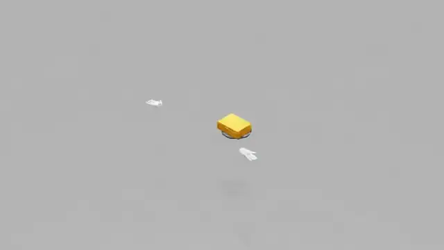
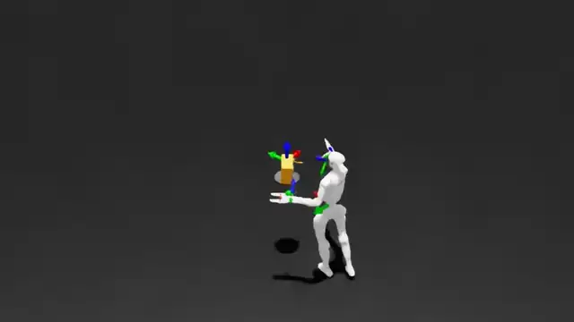
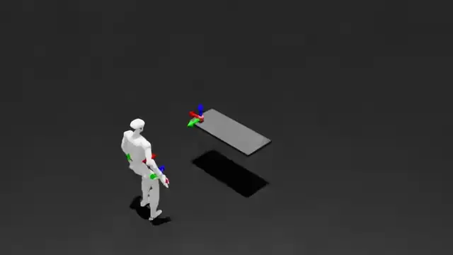
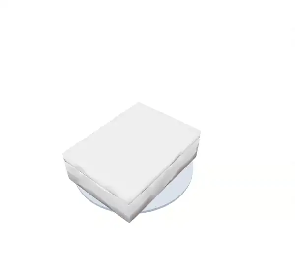
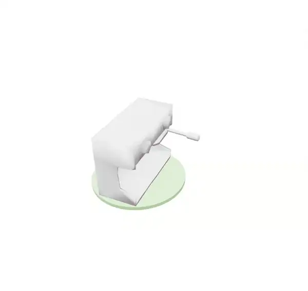
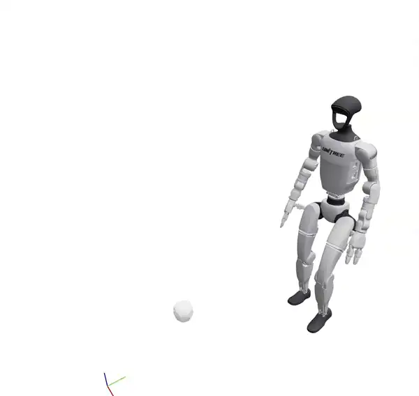
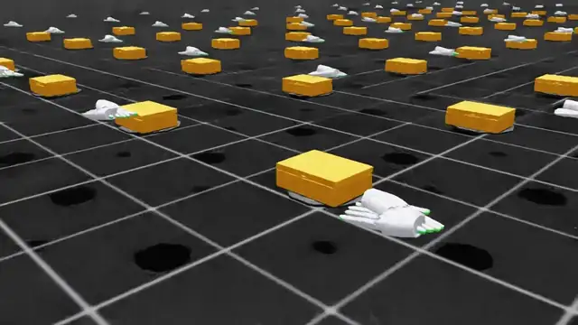
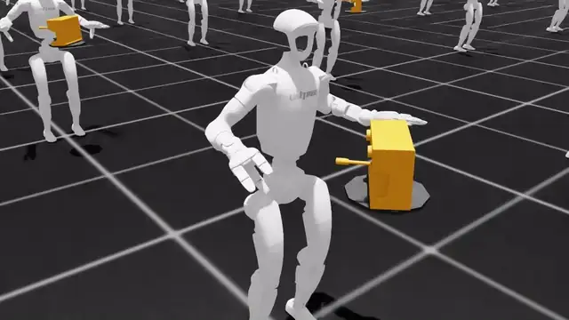
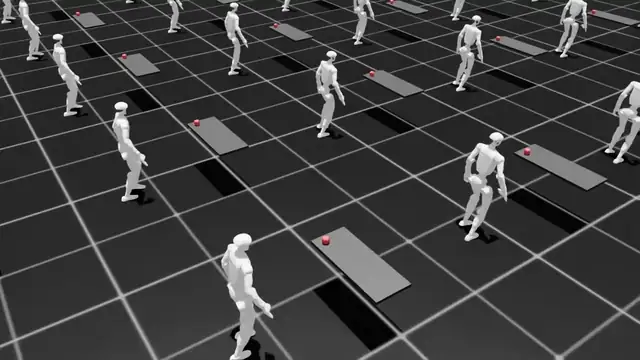

# Robotic Grounding

> 📐 **New here?** See [`docs/ARCHITECTURE.md`](docs/ARCHITECTURE.md) for the architecture, contents map, and where-to-find-what guide.

## Prerequisites

- Install [Docker](https://docs.docker.com/engine/install/ubuntu/) and [post-installation](https://docs.docker.com/engine/install/linux-postinstall/#manage-docker-as-a-non-root-user) steps.

- Install [NVIDIA Container Toolkit](https://docs.nvidia.com/datacenter/cloud-native/container-toolkit/latest/install-guide.html).

- Make sure you have access to `nvcr.io/nvstaging/isaac-amr`. You can request it by asking in the `#swngc-help` Slack channel.

- Install Git LFS and `pre-commit` dependencies.
    ```bash
    bash workflow/setup_deps.sh
    ```
    This script installs `git-lfs` and `pre-commit` and ensures `workflow/run.sh` is executable. You may need to restart your shell for pipx PATH changes.

- NVIDIA Driver Version 580.126.09, CUDA Version: 13.0 Recommended. In case of visualization errors, check NVIDIA driver version.

## Environment & Credentials

`<HMD>` (human-motion-data root) used below is a directory you choose — e.g.
`~/datasets/human_motion_data` — that holds `mano/` and one subdirectory per dataset
(`taco/`, `hot3d/`, …); see [docs/SETUP.md §4](docs/SETUP.md) for the full layout.

You download every dataset yourself from its **original public source**. You should provide the
license-gated assets you register for yourself:

- **MANO hand models** (required by the `load` stage). Register and accept the license at
  [mano.is.tue.mpg.de](https://mano.is.tue.mpg.de/), download `mano_v1_2.zip`, and place the two
  `.pkl` files at `<HMD>/mano/models/MANO_LEFT.pkl` and `<HMD>/mano/models/MANO_RIGHT.pkl`
  (see [docs/SETUP.md §5](docs/SETUP.md)). MANO is never committed and is read only at load time.
- **Datasets** — each has its own registration/download portal. Follow the per-dataset guide in
  [docs/SETUP.md §6](docs/SETUP.md) (taco, hot3d, arctic, grab, h2o, dexycb) to download and lay
  the data out under `<HMD>/<dataset>/`.

Pass the MANO directory at runtime with `--mano-dir <HMD>/mano`.

## Docker Usage

Development should be **inside** the Container, and Git operations should be done **outside** the Container on the host machine.

```bash
./workflow/run.sh build [version] # Build Docker image and tag it with [version]
./workflow/run.sh start [version] [gpu] # Run and enter the Container with specific version and GPU
./workflow/run.sh shell [version] [gpu] # Enter Container from new shell with specific version and GPU
./workflow/run.sh stop [version] [gpu] # Stop the Container with specific version and GPU
```

## Development

You can launch the container with commands in the Docker Usage section.

If using VSCode or Cursor, you can use the `Attach to Running Container` feature in Dev Containers extension by `command/ctrl + shift + p`.  Inside the container, you can use Python interpreter `/workspace/isaaclab/_isaac_sim/python.sh` for debugging. The working directory is `/workspace/video_to_data/robotic_grounding`.

Currently, due to Isaac Lab's image requiring root for Omniverse, we are using the root user for the container. There can be some permission issues, but they can be bypassed with `sudo chown -R $(whoami) .` in the host machine.

For agent-oriented checks, use this quick path before opening a merge request. Commands assume the `robotic_grounding/` package root, and Isaac commands should run inside the container. OSMO and W&B are not required for the local smoke tests below.

## Agent Smoke Tests

### Assets and dummy agent

| Floating hands — Sharpa | Whole body — ReconHand | Whole body — ReconBody |
| :---: | :---: | :---: |
|  |  |  |
| *Box grab, zero-action dummy agent* | *Espresso use, zero-action dummy agent* | *Apple pick, zero-action dummy agent* |

Motion data resolves under `source/robotic_grounding/robotic_grounding/assets/human_motion_data/`. The safest local shorthand is `<dataset>/<dataset>_processed/<sequence_id>/sharpa_wave`, for example `arctic/arctic_processed/dataset_s07_box_grab_01/sharpa_wave`.

Generate the retargeted motion + object assets by running the pipeline on a dataset you
downloaded per [docs/SETUP.md](docs/SETUP.md):

```bash
# From the host — builds the right image per stage (load → urdf → processed → support):
python scripts/run_pipeline_docker.py arctic \
  --hmd <HMD> --mano-dir <HMD>/mano --max-sequences 2
```

This writes RL-ready parquets to `<HMD>/arctic/arctic_processed/...` and the object
URDFs/meshes to `<HMD>/arctic/object_assets/`. Make a partition visible to the agent by
placing it under `assets/human_motion_data/<dataset>/` (copy or symlink), or pass its path
directly via `--motion_file`.

Stages that load real object geometry — retargeting, kinematic replay, support-surface
reconstruction, scene view, and training — need the object assets present. The pipeline's
`urdf` stage generates them; to (re)generate them standalone from already-downloaded
meshes, run `python scripts/generate_rigid_urdfs.py --dataset <dataset>`. See
[workflow/data_pipeline.md](workflow/data_pipeline.md#object-assets-urdfs--meshes).

(The `--use_primitive_urdfs` dummy-agent smoke test below does not need them.)

Run a GUI dummy-agent smoke test inside the container:

```bash
python scripts/rsl_rl/dummy_agent.py \
  --task Sharpa-V2D-v0-Play \
  --motion_file arctic/arctic_processed/dataset_s07_box_grab_01/sharpa_wave \
  --num_envs 1 \
  --use_primitive_urdfs
```

Run the same check headless with a short MP4:

```bash
python scripts/rsl_rl/dummy_agent.py \
  --headless \
  --task Sharpa-V2D-v0-Play \
  --motion_file arctic/arctic_processed/dataset_s07_box_grab_01/sharpa_wave \
  --num_envs 1 \
  --use_primitive_urdfs \
  --record_video \
  --output_dir /tmp/rg_dummy_agent_video \
  --video_length 300
```

Success means Isaac starts, the task registers, `SceneConfig.from_motion_file` loads the parquet partition, no missing-asset exception is raised, and the simulation advances.

For the whole-body **ReconHand** env, point the same script at a planned `g1_dex3`
partition (produced by [Retargeting](#retargeting) → [Whole-body planning](#whole-body-planning)).
Zero actions feed the SONIC decoder, so this is an open-loop replay of the planned motion —
a quick check that the Dex3 robot, articulated object, and support surface spawn:

```bash
python scripts/rsl_rl/dummy_agent.py \
  --task SonicG1-ReconHand-v0 \
  --motion_file arctic/planner_processed/dataset_s09_espressomachine_use_02/g1_dex3 \
  --num_envs 1
```

### Training

Use the [RL training](#rl-training) section below for a local `train.py` one-iteration smoke test. If W&B is not configured, keep local smoke tests on TensorBoard by passing `--logger tensorboard`.

## Retargeting

| Floating hands — Sharpa | Floating hands — Dex3 | Whole body — G1 |
| :---: | :---: | :---: |
|  |  |  |
| *Box-grab retargeting in Viser* | *Espresso-use retargeting in Viser* | *Apple-pick retargeting in Viser* |

The full hand→robot retargeting pipeline is driven from the **host** by
`scripts/run_pipeline_docker.py`, which runs each stage in the right Docker image
(`load → urdf → processed → support → vis`). First download a dataset from its original
public source — see **[docs/SETUP.md](docs/SETUP.md)** — and lay it out under `<HMD>/<dataset>/`.

### Hand-only (Sharpa)
```bash
# Build the two images once (loader + robotic-grounding):
python scripts/run_pipeline_docker.py --build-only

# Run the pipeline on a downloaded dataset (e.g. arctic). Retargeted parquets land in
# <HMD>/arctic/arctic_processed/sequence_id=.../robot_name=sharpa_wave/.
python scripts/run_pipeline_docker.py arctic \
    --hmd <HMD> --mano-dir <HMD>/mano --max-sequences 2

# Visualize a retargeted result (viser HTML / MP4):
python scripts/run_pipeline_docker.py arctic --hmd <HMD> --mano-dir <HMD>/mano --stages vis
```

The `load` stage (MANO forward-kinematics) runs in the separate `v2d_task_library_loader`
image and produces the `{dataset}_loaded` Parquet that the retarget step consumes; the
orchestrator handles both images for you. To run the stages manually inside the container
instead (Pattern B: `run_load_local.sh` + `run_retarget_local.sh`), or to retarget a single
dataset script (`scripts/retarget/<dataset>_to_sharpa.py`, `scripts/retarget/vis_retargeted.py`),
see [docs/SETUP.md §4](docs/SETUP.md).

### Hand-to-Dex3 (ReconHand)

Retarget a hand-object clip to the Dex3 hands for the whole-body planner. Consumes the
`{dataset}_loaded` MANO parquet from the `load` stage above and writes
`<output_dir>/sequence_id=<seq>/robot_name=dex3/`. Scale defaults to 1.0 (arctic) / 1.2 (taco).

```bash
DATA=source/robotic_grounding/robotic_grounding/assets/human_motion_data

# arctic (e.g. espresso)
python scripts/retarget/arctic_to_dex3.py \
  --input_dir $DATA/arctic/arctic_loaded --output_dir $DATA/arctic/arctic_dex3 \
  --sequence_id dataset_s09_espressomachine_use_02 --device cuda:0 --save

# taco
python scripts/retarget/taco_to_dex3.py \
  --input_dir $DATA/taco/taco_loaded --output_dir $DATA/taco/taco_dex3 \
  --sequence_id taco_skim_off__spoon__pan_20230926_011 --device cuda:0 --save
```

Next: [Whole-body planning](#whole-body-planning) turns this into a G1 trajectory.

### Whole-body (SOMA → G1)
```bash
# Retarget and save Parquet (data_folder must contain soma_params.npz, object/textured_mesh.obj)
python scripts/retarget/soma_to_g1.py <data_folder> --save

# Visualize retargeting in Viser (port 8080)
python scripts/retarget/soma_to_g1.py <data_folder> --visualize
```

### Kinematic replay (all schemas)
Replay retargeted motion in Isaac Lab. Supports both whole-body (G1) and dual floating-hand (Sharpa/Dex3) data.
Robot and object are teleported kinematically — no physics forces act on them.
```bash
# Replay G1 retargeted data (loops by default)
python scripts/replay_motion.py \
    --motion_file source/robotic_grounding/robotic_grounding/assets/human_motion_data/whole_body/soma/sequence_id=<seq>/robot_name=g1

# Replay hand-only data
python scripts/replay_motion.py \
    --motion_file source/robotic_grounding/robotic_grounding/assets/human_motion_data/arctic_processed/sequence_id=<seq>/robot_name=sharpa_wave

# Options
python scripts/replay_motion.py --motion_file <path> --speed 0.5   # Slow motion
python scripts/replay_motion.py --motion_file <path> --no-loop     # Stop at last frame
python scripts/replay_motion.py --motion_file <path> --headless    # No GUI
```

### Support surface reconstruction
Detect where objects rest on surfaces above the ground plane and generate collision geometry for RL training.
```bash
# For hand-only datasets (auto-detects schema)
python scripts/reconstruct_support_surfaces.py --input_dir <loader_output_dir> --sequence_id <seq>

# For G1 whole-body retargeted data
python scripts/reconstruct_support_surfaces.py --input_dir source/robotic_grounding/robotic_grounding/assets/human_motion_data/whole_body/soma --sequence_id <seq>

# Or use the dataset shortcut
python scripts/reconstruct_support_surfaces.py --dataset soma_g1 --sequence_id <seq>
```

Objects resting on the ground are automatically filtered out (threshold configurable via `--ground_threshold`).

### Scene viewer (static spawn verification)
```bash
python scripts/view_scene.py --motion_file <parquet_partition_path>
```

## Whole-body planning

The planner turns a Dex3 EE trajectory (from [Hand-to-Dex3](#hand-to-dex3-reconhand)
retargeting) into a whole-body G1 reference for the `SonicG1-ReconHand-*` envs. Run it
inside the container from `robotic_grounding/`. `--output $DATA/<dataset>` writes the plan
under the dataset dir (beside `object_assets/` and `reconstructed_stage/`) so it trains in
place — no copy step.

```bash
DATA=source/robotic_grounding/robotic_grounding/assets/human_motion_data

python -m robotic_grounding.planner.g1_planner --robot dex3 \
  --v2d_parquet $DATA/arctic/arctic_dex3 --v2d_robot_name dex3 \
  --v2d_sequence dataset_s09_espressomachine_use_02 \
  --v2d_start_at_first_contact --v2d_pre_contact_frames 23 \
  --v2d_end_after_last_contact_frames 7 --target_fps 100 \
  --workspace_offset -0.10 0.0 -0.05 --heading_align_frame first_contact \
  --output $DATA/arctic --no_viewer
```

Writes `arctic/planner_processed/sequence_id=<seq>/robot_name=g1_dex3/` and
`arctic/reconstructed_stage/<seq>_support.usda`. Planner flags are tuned per sequence; see
[`v2d_whole_body/EXAMPLE_SEQUENCES.md`](source/robotic_grounding/robotic_grounding/tasks/v2d_whole_body/EXAMPLE_SEQUENCES.md)
for all three example sequences and the two-stage training recipe.

## RL training

| Floating hands — Sharpa | Whole body — ReconHand | Whole body — ReconBody |
| :---: | :---: | :---: |
|  |  |  |
| *Box-grab trained-policy rollout* | *Espresso-use trained-policy rollout* | *Apple-pick trained-policy rollout* |

Commands in this section assume you are inside the container from the
`robotic_grounding/` package root.

### Smoke tests

Short runs that verify the env builds, assets load, and training steps — no W&B
or OSMO needed when the motion data is present locally. Keep them on
`--logger tensorboard`.

```bash
# Run a real one-iteration train smoke test.
python scripts/rsl_rl/train.py \
  --headless \
  --task Sharpa-V2D-v0 \
  --motion_file arctic/arctic_processed/dataset_s07_box_grab_01/sharpa_wave \
  --num_envs 1 \
  --max_iterations 1 \
  --logger tensorboard \
  --run_name smoke_train \
  --use_primitive_urdfs \
  agent.num_steps_per_env=8 \
  agent.save_interval=1

# Evaluate the checkpoint produced by the smoke train.
CHECKPOINT=$(find logs/rsl_rl -path '*smoke_train*/model_*.pt' | sort -V | tail -1)
python scripts/rsl_rl/eval.py \
  --headless \
  --task Sharpa-V2D-v0 \
  --motion_file arctic/arctic_processed/dataset_s07_box_grab_01/sharpa_wave \
  --num_envs 1 \
  --checkpoint "$CHECKPOINT" \
  --use_primitive_urdfs

# Whole-body (ReconHand) eight-iteration train smoke, stage-1 recipe
# (see Retargeting -> Whole-body planning)
python scripts/rsl_rl/train.py \
  --headless \
  --task SonicG1-ReconHand-Stage1-v0 \
  --motion_file arctic/planner_processed/dataset_s09_espressomachine_use_02/g1_dex3 \
  --num_envs 256 \
  --max_iterations 8 \
  --zero-actor \
  --logger tensorboard \
  --run_name recon_espresso_smoke

# Whole-body (ReconBody / TPV) eight-iteration train smoke
python scripts/rsl_rl/train.py \
  --headless \
  --task SonicG1-ReconBody-v0 \
  --motion_file whole_body/soma/apple_pick_optimized/g1 \
  --num_envs 256 \
  --max_iterations 8 \
  --zero-actor \
  --logger tensorboard \
  --run_name recon_body_apple_smoke

# Other entry points.
python scripts/rsl_rl/dummy_agent.py  # Run an environment with zero actions.
python scripts/rsl_rl/eval.py         # Evaluate a trained checkpoint and export policy.
```

See the `Agent Smoke Tests` section above for the required asset layout and dummy-agent commands.

### Full training

Full training uses the real object assets (the pipeline's `urdf` stage). Drop
the smoke overrides (`--num_envs 1`,
`--max_iterations 1`, `--use_primitive_urdfs`, `agent.num_steps_per_env`,
`agent.save_interval`) and let each task's PPO cfg drive iterations and batching.

Floating-hand (Sharpa):
```bash
python scripts/rsl_rl/train.py \
  --headless --task Sharpa-V2D-v0 \
  --motion_file arctic/arctic_processed/dataset_s07_box_grab_01/sharpa_wave \
  --num_envs 4096 --logger tensorboard --video --run_name box_grab
```

Whole-body ReconBody / TPV (retarget SOMA first via [Retargeting](#retargeting);
more in the [whole-body task README](source/robotic_grounding/robotic_grounding/tasks/v2d_whole_body/README.md#running)):
```bash
python scripts/rsl_rl/train.py \
  --headless --task SonicG1-ReconBody-v0 \
  --motion_file whole_body/soma/apple_pick_optimized/g1 \
  --num_envs 4096 --logger tensorboard --video --run_name recon_body_apple
```

Whole-body ReconHand — the three-stage retarget → plan → train recipe
(warm-up → contact grounding → finetune), documented per sequence in
[`v2d_whole_body/EXAMPLE_SEQUENCES.md`](source/robotic_grounding/robotic_grounding/tasks/v2d_whole_body/EXAMPLE_SEQUENCES.md).

## RL Tasks
- `Sharpa-V2D-v0-Play`
- `Sharpa-V2D-v0`
- `SonicG1-ReconBody-v0`
- `SonicG1-ReconHand-v0`
- `SonicG1-ReconHand-EpisodeTimeout-v0`
- `SonicG1-ReconHand-Stage1-v0` — no-collision warm-up
- `SonicG1-ReconHand-Stage2-v0` — contact grounding
- `SonicG1-ReconHand-Stage3-v0` — full-sequence finetune

## Visualizer

Browse retargeted sequences as 3D animations at **http://10.111.83.14:8080/**

To run the server yourself or generate new recordings:

```bash
# Download datasets from OSMO
python visualizer/sync_visualizer_data.py

# Start the gallery server
python visualizer/serve.py          # → http://0.0.0.0:8080

# Serve vis_retargeted.py output directly (no copy needed)
python visualizer/serve.py --html-dir /path/to/v2d_arctic_retarget_exp_200
```

See [visualizer/README.md](visualizer/README.md) for the full reference: parallel downloads, generating `.viser` files inside Docker, and running as a systemd service.
