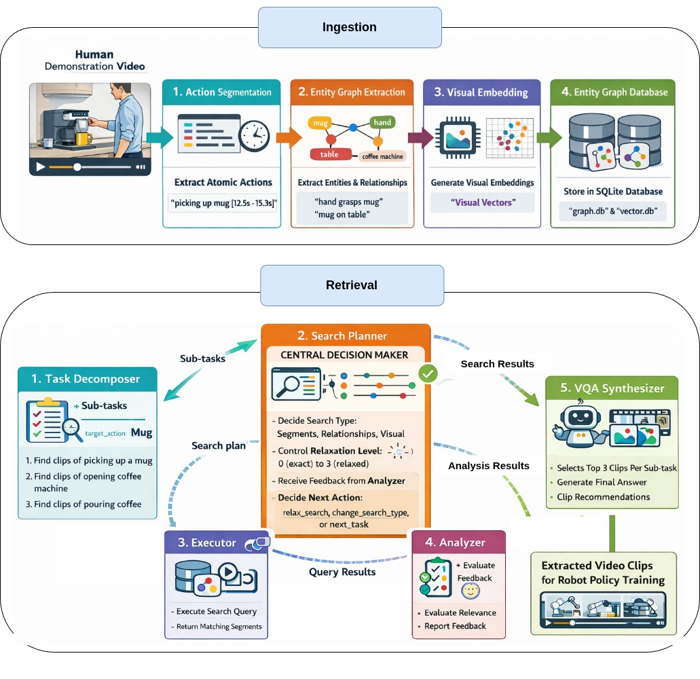

Video Ingestion Agent
=====================

**Agentic Workflow for Robot Demonstration Video Analysis**

Video Ingestion Agent turns long robot demonstration videos into a searchable database of action
clips. Given a 10-minute video of a person making coffee, it finds every "pick up mug",
"pour water", and "open drawer" moment, indexes them in an entity graph, and lets you
retrieve them with natural language queries like *"Find all clips where someone picks up
a cup."*

----

Start Here
----------

.. grid:: 2

   .. grid-item-card:: Getting Started
      :link: pages/getting_started
      :link-type: doc

      Install dependencies, start the vLLM server, and run your first pipeline.

   .. grid-item-card:: Web Interface
      :link: pages/webapp
      :link-type: doc

      Gradio UI for interactive ingestion, database inspection, and querying.

   .. grid-item-card:: OSMO Deployment
      :link: pages/deployment
      :link-type: doc

      Deploy with Docker and OSMO for production and multi-GPU batch runs.

   .. grid-item-card:: Troubleshooting
      :link: pages/troubleshooting
      :link-type: doc

      Common issues and solutions — clips, retrieval, models, and server problems.

System Design
-------------

.. grid:: 2

   .. grid-item-card:: Architecture
      :link: pages/architecture
      :link-type: doc

      Understand the overall design — ingestion pipeline, retrieval agent, and how they connect.

   .. grid-item-card:: Ingestion Pipeline
      :link: pages/ingestion_pipeline
      :link-type: doc

      Segmentation, verification, refinement strategies, entity extraction, and batch processing.

   .. grid-item-card:: Retrieval Agent
      :link: pages/retrieval_agent
      :link-type: doc

      LangGraph-based agentic search with task decomposition and progressive relaxation.

   .. grid-item-card:: Database Design
      :link: pages/database_design
      :link-type: doc

      Entity graph and vector database schemas, indexes, and search operations.

Configuration & Reference
--------------------------

.. grid:: 3

   .. grid-item-card:: Model Backends
      :link: pages/model_backends
      :link-type: doc

      Local, vLLM, and API backends — choosing and configuring each one.

   .. grid-item-card:: Configuration
      :link: pages/configuration
      :link-type: doc

      YAML config reference for models, segmentation, verification, and feature toggles.

   .. grid-item-card:: Prompt Reference
      :link: pages/prompts
      :link-type: doc

      Every prompt used across segmentation, verification, entity extraction, and retrieval.

Tools & Operations
------------------

.. grid:: 2

   .. grid-item-card:: Benchmark
      :link: pages/benchmark
      :link-type: doc

      EPIC-KITCHENS evaluation suite with mAP, boundary metrics, and annotation accuracy.

   .. grid-item-card:: Development
      :link: pages/development
      :link-type: doc

      Set up a dev environment, run tests, and contribute to the project.

.. toctree::
   :maxdepth: 1
   :caption: Start Here
   :hidden:

   pages/getting_started
   pages/webapp
   pages/deployment
   pages/troubleshooting

.. toctree::
   :maxdepth: 1
   :caption: System Design
   :hidden:

   pages/architecture
   pages/ingestion_pipeline
   pages/retrieval_agent
   pages/database_design

.. toctree::
   :maxdepth: 1
   :caption: Configuration & Reference
   :hidden:

   pages/model_backends
   pages/configuration
   pages/prompts

.. toctree::
   :maxdepth: 1
   :caption: Tools & Operations
   :hidden:

   pages/benchmark
   pages/development
