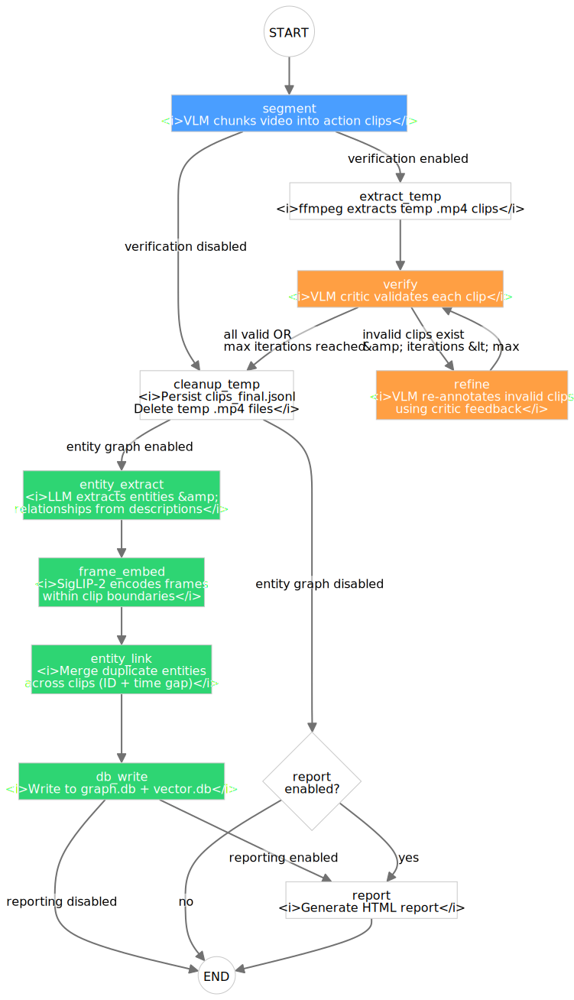

Ingestion Pipeline
==================

The ingestion pipeline transforms raw robot demonstration videos into a structured entity
graph database. It is implemented as a LangGraph state graph in
``src/video_ingestion_agent/ingestion/ingestion_graph.py``.

Pipeline Stages
---------------

.. raw:: html

   

     <button onclick="zoomSvg('ingestion-svg',1.2)">+</button>
     <button onclick="zoomSvg('ingestion-svg',1/1.2)">−</button>
     <button onclick="resetSvg('ingestion-svg')">Reset</button>
   

   

     <object id="ingestion-svg" data="../_images/ingestion_langgraph.svg" type="image/svg+xml"
       style="width:100%;transform-origin:center top;transition:transform .2s"></object>
   

Each stage can be toggled on/off via configuration:

.. list-table::
   :header-rows: 1
   :widths: 20 50 30

   * - Stage
     - Description
     - Config Toggle
   * - **Segmentation**
     - Chunk-based VLM processing to identify atomic actions
     - Always on
   * - **Verification**
     - VLM critic evaluates clip quality and boundaries
     - ``enable_verification``
   * - **Refinement**
     - Iterative re-annotation of invalid clips using critic feedback
     - ``enable_refinement``
   * - **Entity Graph**
     - Entity extraction, embeddings, linking, and DB write
     - ``enable_entity_graph``
   * - **Reporting**
     - HTML report with statistics and per-clip details
     - ``enable_reporting``

Stage 1: Segmentation
----------------------

**Module:** :code_link:`<src/video_ingestion_agent/ingestion/segmentation/segmenter.py>`

The ``HybridSegmenter`` processes videos by:

1. **Chunking** the video into overlapping windows (default: 15s chunks, 1.5s overlap)
2. **Sampling frames** at a configured FPS rate (default: 4 fps) for VLM input
3. **Running the VLM** on each chunk to identify atomic action segments with:

   - Start/end timestamps (relative to the chunk)
   - Action label and object
   - Natural language description

4. **Converting** chunk-relative timestamps to absolute video timestamps
5. **Merging** overlapping segments via overlap-based dedup

The chunk-based approach is necessary because VLMs have limited context windows and cannot
process entire long videos at once.

Clip Deduplication
^^^^^^^^^^^^^^^^^^^

**Module:** :code_link:`<src/video_ingestion_agent/ingestion/segmentation/dedup.py>`

When chunks overlap, the same action may be detected in multiple chunks. The
``ClipDeduplicator`` resolves this by sorting clips by start time and merging pairs whose
temporal overlap exceeds a configurable threshold. Two strategies are available, selected via
the ``dedup_method`` config key:

.. list-table::
   :header-rows: 1
   :widths: 15 85

   * - Method
     - Behaviour
   * - ``heuristic``
     - Always merges overlapping pairs. Keeps annotations from the longer clip. Fast and
       deterministic — no LLM calls.
   * - ``llm`` *(default)*
     - Asks a language model whether two overlapping clips describe the same object and action.
       Only merges when the LLM confirms both the object and action match (or are a natural
       continuation). Produces synthesised annotations for merged clips. If the LLM call fails,
       clips are conservatively kept separate (no merge).

The dedup pass runs **once after initial segmentation** (``segment_video`` in
``HybridSegmenter``), merging duplicate detections produced by chunk overlaps. Since the
reannotation refinement strategy never changes clip boundaries, no new overlaps can be
introduced after this initial pass, so no further dedup is needed.

**Threshold tuning.** ``dedup_overlap_threshold`` controls the minimum temporal overlap (in
seconds) required to consider a merge. Positive values require actual overlap; negative values
(e.g. ``-0.1``) also merge clips separated by a small gap. Set to ``null`` to disable
merging entirely.

Stage 2: Verification
---------------------

**Module:** :code_link:`<src/video_ingestion_agent/ingestion/segmentation/critic.py>`

The ``Critic`` is a separate VLM pass that evaluates each clip by actually watching the
extracted video segment. For each clip, the critic assesses:

- **Action accuracy** — Does the described action match what's in the video?
- **Boundary quality** — Do the start/end times tightly bracket the action?
- **Annotation completeness** — Is the description accurate and detailed?

The critic produces a ``VerificationResult`` with:

- Pass/fail verdict
- List of specific issues found
- Suggested refinement strategies (e.g., ``reannotate``)

.. note::

   **Temp Clip Extraction**

   Before verification, the pipeline extracts temporary ``.mp4`` clips using FFmpeg so the
   critic can watch the actual video segment. These temp files are cleaned up after
   verification/refinement.

Stage 3: Refinement
-------------------

**Module:** :code_link:`<src/video_ingestion_agent/ingestion/segmentation/refiner.py>`

For clips that fail verification, the refiner applies the **reannotate** strategy.
The verify-refine loop runs up to ``max_iterations`` times (default: 3). Clips that
still fail after all iterations are kept but flagged.

ReannotateStrategy
^^^^^^^^^^^^^^^^^^

**Module:** :code_link:`<src/video_ingestion_agent/ingestion/segmentation/strategies.py>`

The reannotate strategy re-runs the VLM on the **same extracted clip** with an enhanced prompt
that incorporates the critic's specific feedback (incorrect action, wrong object, boundary
issues). The VLM produces updated annotations (object, action, description) while boundaries
are left unchanged.

Stage 4: Entity Extraction
--------------------------

**Module:** :code_link:`<src/video_ingestion_agent/ingestion/entity_graph/extractors/entity_extractor.py>`

An LLM analyzes the clip descriptions (text-only, no video) to extract structured entities
and relationships:

**Entities** (typed):

- ``person`` — People visible in the scene
- ``object`` — Physical objects being manipulated
- ``location`` — Locations or surfaces

**Relationships** (typed):

- ``interacts-with``, ``uses``, ``picks-up``, ``places-in``, ``moves-to``, etc.
- Each relationship links a source entity to a target entity with timestamps and confidence

Stage 5: Frame Embeddings
--------------------------

**Module:** :code_link:`<src/video_ingestion_agent/ingestion/entity_graph/extractors/visual_extractor.py>`

Frames are sampled from each video at a configured rate (default: 1 fps for embeddings) and
encoded using `SigLIP-2 <https://huggingface.co/google/siglip2-base-patch16-256>`_ to produce
768-dimensional visual embeddings. These embeddings enable semantic visual search during
retrieval.

**Segment tagging.**
Each frame is matched to its enclosing action clip before embedding. The clip's ``clip_id``
is stored in the frame's metadata as ``segment_id``, so embeddings are linked to the exact
action segment they belong to. During retrieval, this link allows the agent to resolve
individual frame hits back to their full action clips with precise temporal boundaries,
instead of treating frames as isolated data points.

Stage 6: Entity Linking
------------------------

**Module:** :code_link:`<src/video_ingestion_agent/ingestion/entity_graph/entity_linker.py>`

Entities extracted from different clips may refer to the same real-world object. The entity
linker deduplicates by:

- Comparing entity names and types across segments
- Checking temporal proximity (within ``max_time_gap`` seconds)
- Merging entities that likely refer to the same object

Stage 7: Database Write
------------------------

**Module:** :code_link:`<src/video_ingestion_agent/ingestion/entity_graph/database_writer.py>`

All extracted data is written to two SQLite databases:

- **graph.db** — Video metadata, entities, relationships, and action segments
- **vector.db** — Per-frame SigLIP-2 embeddings for semantic visual search. Each frame
  embedding records its ``segment_id`` so retrieval can cross-reference the two databases.

Both databases use WAL mode for safe concurrent writes during batch ingestion.

See :doc:`/pages/database_design` for the full schema, table descriptions, indexes, and
search operations.

Stage 8: Report Generation
---------------------------

**Module:** :code_link:`<src/video_ingestion_agent/ingestion/report.py>`

Generates an HTML report with:

- Pipeline execution summary and timings
- Per-clip details with timestamps, annotations, and verification status
- Aggregate statistics (clip count, average duration, action distribution)

Batch Ingestion
---------------

For processing large video datasets (1000+ videos):

.. code-block:: bash

   python scripts/run_batch_ingestion.py \
     --input-dir /path/to/videos \
     -c configs/batch_ingestion.yaml \
     --output-dir runs/batch \
     --num-shards 8 --resume

**Key features:**

- **Video discovery** — Recursively finds ``.mp4``, ``.mov``, ``.mkv`` files
- **LPT sharding** — Duration-aware load balancing across shards (see below)
- **Resume** — ``--resume`` skips videos already present in ``graph.db``
- **Error isolation** — A failed video is logged and skipped; the shard continues
- **Shared database** — All shards write to a single ``graph.db`` and ``vector.db``

LPT Sharding Algorithm
^^^^^^^^^^^^^^^^^^^^^^^

**Module:** :code_link:`<src/video_ingestion_agent/utils/sharding.py>`

Naively splitting N videos into K shards by index (round-robin) can produce highly imbalanced
workloads when video durations vary (e.g., one shard gets ten 30-second videos, another gets
two 5-minute videos). Video Ingestion Agent uses a **Longest Processing Time (LPT)** greedy algorithm to
minimise the maximum shard duration:

.. mermaid::

   flowchart TD
       A["Probe all video durations via ffprobe"] --> B["Sort videos longest-first"]
       B --> C["Greedy assignment loop"]
       C --> D{"Assign next video\nto lightest shard"}
       D --> C
       C --> E["All shards have\nnear-equal total duration"]

Steps:

1. **Probe** — ``ffprobe`` reads the header of each video to obtain its duration (fast,
   no decoding).
2. **Sort** — Videos are sorted by duration, longest first.
3. **Assign** — Iterate over the sorted list. For each video, assign it to the shard whose
   cumulative duration is the smallest. This is the classic greedy LPT heuristic, producing
   a total makespan within 4/3 of optimal.
4. **Fallback** — If all duration probes fail (e.g., ``ffprobe`` not installed), the
   algorithm falls back to round-robin sharding.

Each shard is a **deterministic, disjoint subset** of videos, so multiple shards can run as
independent processes (or OSMO tasks) without coordination. Combined with SQLite WAL mode,
all shards write to a single shared database safely.

See Also
--------

- :doc:`/pages/database_design` — Full schema for graph.db and vector.db
- :doc:`/pages/prompts` — Prompt text used in segmentation, verification, and entity extraction
- :doc:`/pages/configuration` — Tuning pipeline parameters for your domain
- :doc:`/pages/deployment` — Running batch ingestion at scale with OSMO
