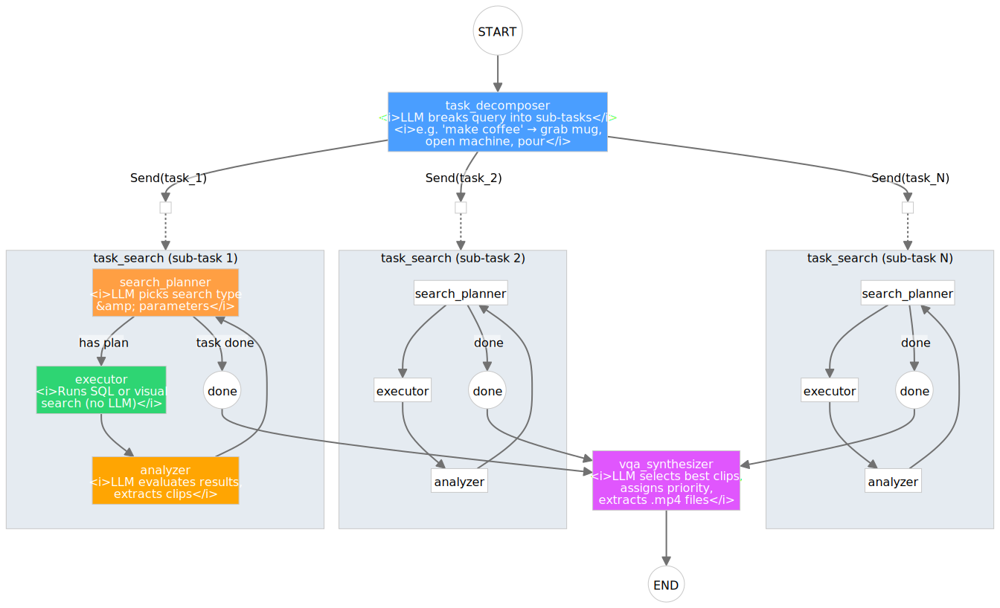

Retrieval Agent
===============

The retrieval agent finds and extracts action clips from the entity graph database using
natural language queries. It is implemented as a LangGraph agent in
``src/video_ingestion_agent/retrieval/retrieval_graph.py``.

Agent Architecture
------------------

.. raw:: html

   

     <button onclick="zoomSvg('retrieval-svg',1.2)">+</button>
     <button onclick="zoomSvg('retrieval-svg',1/1.2)">−</button>
     <button onclick="resetSvg('retrieval-svg')">Reset</button>
   

   

     <object id="retrieval-svg" data="../_images/retrieval_langgraph.svg" type="image/svg+xml"
       style="width:100%;transform-origin:center top;transition:transform .2s"></object>
   

1. Decompose the query into sub-tasks
2. Search for each sub-task (in parallel by default, or sequentially)
3. Analyze results, relax constraints if needed
4. Select the best clips for output

Execution Modes
^^^^^^^^^^^^^^^^

The agent supports two execution modes, controlled by ``agent.parallel_tasks``.

**Parallel** (default, ``parallel_tasks: true``):

Sub-tasks are dispatched concurrently via the LangGraph Send API. Each sub-task
gets its own compiled subgraph containing the search loop
(``search_planner -> executor -> analyzer``). Results are merged automatically
via state reducers when all branches complete.

.. code-block:: text

   START -> task_decomposer -+-> task_search (task 1) -+-> vqa_synthesizer -> END
                             +-> task_search (task 2) -+
                             +-> task_search (task N) -+

Each ``task_search`` branch is a self-contained subgraph defined in
``retrieval/task_search_subgraph.py``. It receives a ``TaskSearchState`` containing
a single sub-task and runs the planner/executor/analyzer loop until the task is
complete or the max search attempts are exhausted. When all branches finish,
only two keys are merged back into the parent state:

- ``task_results`` — per-task clips and analysis (merged via ``merge_dict``)
- ``working_memory`` — search history entries (merged via ``append_list``)

All transient per-task keys (``current_search_query``, ``search_relaxation_level``,
etc.) are discarded, since the VQA synthesizer only reads ``task_results``.

**Sequential** (``parallel_tasks: false``):

Sub-tasks are processed one at a time via a ``current_task_idx`` counter,
matching the original behaviour. Each task's search history is visible to
subsequent tasks via working memory.

.. code-block:: text

   START -> task_decomposer -> search_planner <-> executor <-> analyzer -> vqa_synthesizer -> END

Choosing a Mode
"""""""""""""""

.. list-table::
   :header-rows: 1
   :widths: 15 42 43

   * -
     - Parallel (default)
     - Sequential
   * - **Speed**
     - Up to N-fold wall-clock speedup for N sub-tasks
     - Tasks run one at a time
   * - **Cross-task context**
     - Each task searches independently (no shared working memory)
     - Later tasks see earlier tasks' results via working memory
   * - **VQA synthesizer input**
     - Identical ``task_results`` dict
     - Identical ``task_results`` dict
   * - **When to use**
     - Most queries; sub-tasks are usually independent
     - Queries where tasks build on each other (e.g. "find X, then find Y near X")

Agent Nodes
-----------

TaskDecomposer
^^^^^^^^^^^^^^

**Module:** :code_link:`<src/video_ingestion_agent/retrieval/nodes/task_decomposer.py>`

Breaks a high-level query into specific sub-tasks. For example:

   **Query:** "Find clips of making coffee"

   **Sub-tasks:**

   1. Find "grab mug" actions targeting "mug" objects
   2. Find "open" actions targeting "coffee machine"
   3. Find "pour" actions targeting "coffee" or "cup"

Each sub-task specifies a target action and object to guide the search.

SearchPlanner
^^^^^^^^^^^^^

**Module:** :code_link:`<src/video_ingestion_agent/retrieval/nodes/search_planner.py>`

The central decision-maker that controls the search loop. For each sub-task, it:

- Plans the search strategy (entity graph search, visual search, or both)
- Decides whether to accept results, relax constraints, or move to the next sub-task
- Controls iteration count to prevent infinite loops

Executor
^^^^^^^^

**Module:** :code_link:`<src/video_ingestion_agent/retrieval/nodes/executor.py>`

Executes searches against the database using two complementary tools:

**Entity Graph Search**

Queries ``graph.db`` to find entities and segments by name, type, or relationship:

.. code-block:: text

   Find entities where type="object" AND name LIKE "%mug%"
     -> Find relationships where target=entity_id AND type="picks-up"
       -> Return linked action segments

**Visual Embedding Search**

Queries ``vector.db`` using SigLIP-2 text-to-image similarity:

.. code-block:: text

   Encode "person picking up a mug" as text embedding
     -> Find frames with highest cosine similarity
       -> Group frames by segment_id
         -> Resolve each segment via graph.db action_segments
           -> Return action clips with exact boundaries

When frame embeddings carry a ``segment_id`` (set during ingestion), the executor groups
results by segment and cross-references them against the ``action_segments`` table in
``graph.db`` using ``SearchGraphTool.get_segments_overlapping()``. This produces output with
precise clip boundaries, action labels, and object names instead of isolated frame timestamps.
The best-matching segment is selected by temporal overlap with the frame window, with
center-distance as a tie-breaker. The lookup is scoped to the correct video using the
frame's ``video_path`` to prevent cross-video mismatches.

For legacy databases where frames lack ``segment_id``, the executor falls back to plain
per-frame output.

Analyzer
^^^^^^^^

**Module:** :code_link:`<src/video_ingestion_agent/retrieval/nodes/analyzer.py>`

Evaluates search results against the sub-task criteria:

- Scores each candidate clip for relevance
- Determines if enough good clips were found
- Suggests search relaxation if results are poor (e.g., broaden object name, relax action type)

VQASynthesizer
^^^^^^^^^^^^^^

**Module:** :code_link:`<src/video_ingestion_agent/retrieval/nodes/vqa_synthesizer.py>`

Final selection step that picks the top 3 clips per sub-task optimized for robot training:

- Ranks clips by quality and relevance
- Ensures diversity (different viewpoints, contexts)
- Extracts final clips from the source video

Search Tools
------------

.. list-table::
   :header-rows: 1
   :widths: 20 35 45

   * - Tool
     - Module
     - Description
   * - ``search_graph``
     - ``retrieval/tools/search_graph.py``
     - Entity graph queries (SQLite)
   * - ``search_frames``
     - ``retrieval/tools/search_frames.py``
     - Visual embedding similarity (SigLIP-2)
   * - ``extract_clip``
     - ``retrieval/tools/extract_clip.py``
     - FFmpeg clip extraction by timestamp

Configuration
-------------

The retrieval agent is configured via ``configs/retrieval.yaml`` and validated by Pydantic
models defined in ``src/video_ingestion_agent/retrieval/config.py``. Any field omitted from the
YAML file falls back to its Pydantic default.

.. code-block:: yaml

   models:
     llm_model: "Qwen/Qwen3-VL-8B-Instruct"  # LLM for agent reasoning
     llm_backend: "vllm"                       # "local", "vllm", or "api"
     embedding_model: "google/siglip2-base-patch16-256"
     api_key: null                              # Or set NIM_API_KEY env var
     device: "cuda"

   agent:
     max_steps: 10              # Max reasoning iterations
     temperature: 0.0           # Deterministic reasoning
     max_sub_tasks: 5           # Max sub-tasks to decompose a query into
     max_relaxation_levels: 3   # Max search relaxation levels (0-3)
     max_search_attempts: 9     # Max search attempts per sub-task
     parallel_tasks: true       # Run sub-tasks in parallel (false = sequential)

   database:
     directory: "outputs/"  # Path to graph.db and vector.db

   output:
     clips_dir: "outputs/clips"
     clip_padding: 0.5      # Seconds of padding around clip boundaries

   logging:
     level: "INFO"
     save_traces: true
     traces_dir: "outputs/traces"

.. tip::

   Load the config programmatically with ``load_retrieval_config("configs/retrieval.yaml")``,
   or instantiate ``RetrievalConfig()`` for all-defaults. Override individual fields with
   ``config.model_copy(update={"agent": AgentConfig(max_sub_tasks=3)})``.

Usage
-----

.. code-block:: bash

   # Basic query
   python scripts/run_retrieval.py "Find all pick up mug actions" \
     -d outputs/my_video/ \
     --output-dir outputs/clips/

   # The agent outputs extracted clips:
   # outputs/clips/
   #   ├── task_1_pick_up_mug_1.mp4
   #   ├── task_1_pick_up_mug_2.mp4
   #   └── task_1_pick_up_mug_3.mp4

How the Agent Reasons
---------------------

The agent maintains a working memory (reasoning trace) that records its search history,
results, and decisions. This allows it to:

- Avoid repeating failed searches
- Build on partial results
- Make informed decisions about when to relax constraints vs. move on

Agent reasoning traces can be saved for debugging by setting ``save_traces: true``
in the configuration.

See Also
--------

- :doc:`/pages/database_design` — Entity graph and vector database schemas queried by the agent
- :doc:`/pages/prompts` — Full prompt text for each agent node
- :doc:`/pages/configuration` — Retrieval agent configuration options
- :doc:`/pages/webapp` — Interactive query interface using this agent
