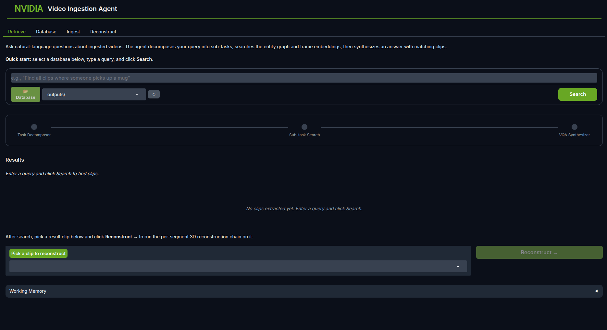
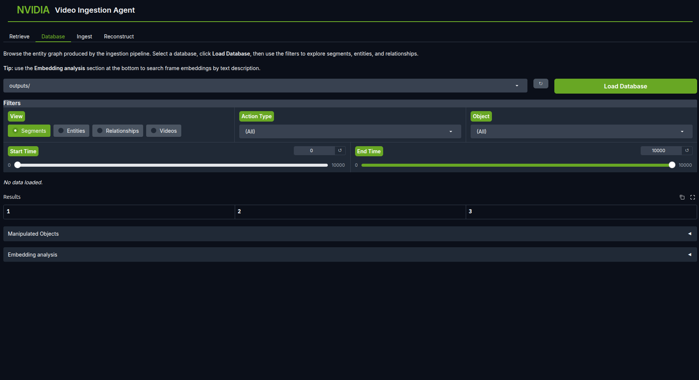
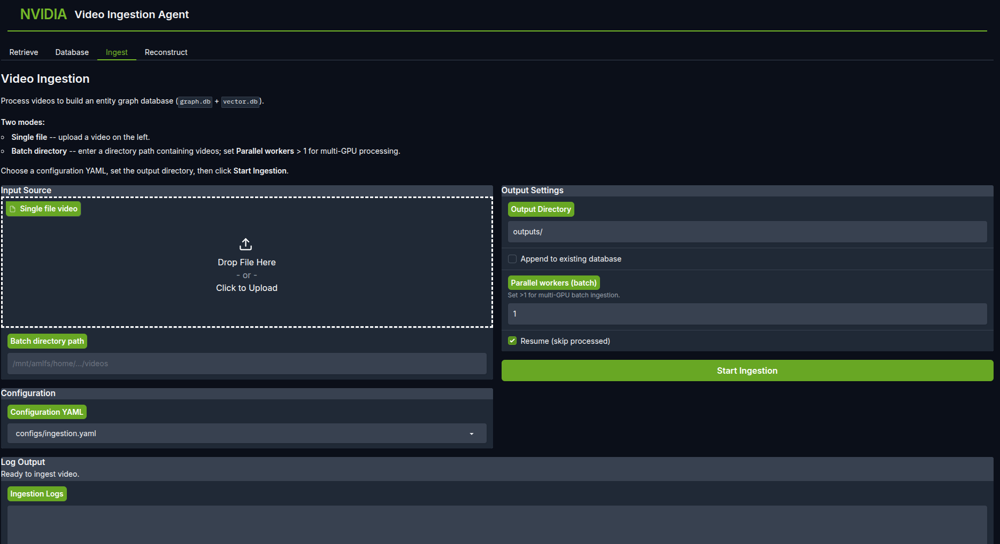
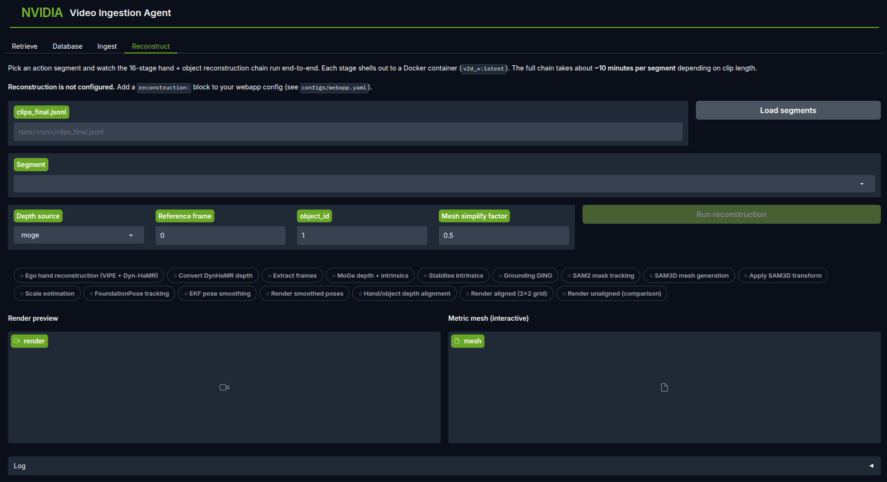

Web Interface
=============

Video Ingestion Agent includes a Gradio-based web interface for interactive video ingestion,
database inspection, and clip retrieval.

Quick Start
-----------

.. code-block:: bash

   # Install webapp dependencies
   uv pip install -e ".[webapp]"

   # Launch the web interface
   python scripts/run_webapp.py

The UI opens at ``http://localhost:7860``.

Interface Overview
------------------

The web app has four tabs (the last is an optional integration example):

Retrieval Tab
^^^^^^^^^^^^^

Use natural language to find and extract clips from the database.

**Features:**

- Enter natural language queries (e.g., "Find all clips of picking up a mug")
- Watch the agent decompose your query into sub-tasks
- View retrieved clips ranked by relevance with inline video players
- Extract clips to files for download

Database Tab
^^^^^^^^^^^^

Browse the entity graph database built during ingestion.

**Features:**

- **Entity browser** — List all entities (persons, objects, locations) with their properties
  and timestamps
- **Relationship browser** — Explore typed interactions between entities (picks-up, places-in,
  uses, etc.)
- **Segment browser** — Search and filter action segments by action label, object, or time
  range
- **Graph visualization** — Interactive NetworkX visualization of the entity graph showing
  nodes (entities) and edges (relationships)

Ingestion Tab
^^^^^^^^^^^^^

Upload a video and run it through the ingestion pipeline interactively.

**Features:**

- Upload video files (mp4, mov, mkv)
- Configure pipeline options (verification, entity graph, etc.)
- Monitor pipeline progress in real-time
- View segmented clips with timestamps and annotations
- Inspect the generated HTML report

Reconstruct Tab
^^^^^^^^^^^^^^^

An optional **integration example** showing how the agent's action segments
feed a downstream 3D reconstruction pipeline (the sibling ``reconstruction``
package). Reconstruction itself is **not** part of the agent; this tab
exists to demonstrate end-to-end usage of an ingested action segment.

Hidden by default — appears only when a ``reconstruction:`` block is
configured in the webapp YAML (see :doc:`/pages/configuration`).

**Setup:** the integration depends on a working ``reconstruction/.venv``,
~110 GB of v2d_* Docker images, and MANO + BMC weights. See
``src/video_ingestion_agent/reconstruction_interface/ego_e2e/README.md``
for the recipe; ``ReconstructionConfig.validate()`` reports which images
and weights are missing if you launch with the block enabled but
unconfigured.

**Features:**

- Pick a segment from a ``clips_final.jsonl`` or jump in from the
  Retrieve tab's "Reconstruct →" button.
- Watch 16-stage progress driven by ``[run ]/[skip]`` markers from the
  upstream orchestrator's stdout.
- Preview the 2x2 grid render and the metric-scale object mesh inline.

Architecture
------------

.. code-block:: text

   src/video_ingestion_agent/webapp/
   ├── app.py                        # Main Gradio application
   ├── config.py                     # Theme, CSS, and database discovery
   ├── tabs/
   │   ├── query_tab.py              # Natural language clip retrieval
   │   ├── database_tab.py           # Entity graph browsing
   │   ├── ingestion_tab.py          # Video upload and pipeline execution
   │   ├── reconstruction_tab.py     # Optional reconstruction integration
   │   └── settings_tab.py           # Runtime settings and model config
   ├── services/
   │   ├── query_service.py          # Retrieval agent backend
   │   ├── database_service.py       # Entity graph queries
   │   ├── ingestion_service.py      # Pipeline execution backend
   │   └── reconstruction_service.py # Reconstruction integration orchestrator
   ├── models/
   │   ├── query_history.py          # Query history persistence
   │   └── reconstruction.py         # Stage definitions + request/result models
   └── components/
       ├── graph_visualizer.py       # Plotly entity graph rendering
       └── pipeline_visualizer.py    # Pipeline progress bar

The web app is structured in three layers:

1. **Tabs** — Gradio UI components and layout
2. **Services** — Backend logic that wraps the pipeline and agent
3. **Components** — Reusable visualization widgets

Deployment on OSMO
------------------

To deploy the web app on an OSMO cluster with a vLLM server and NFS-mounted database:

.. code-block:: bash

   python scripts/run_osmo.py webapp \
     --experiment-name my_demo \
     --nfs-db-dir /path/to/database

This workflow:

1. Starts a vLLM server for VLM inference
2. Symlinks the NFS entity graph database
3. Launches the Gradio UI on port 7860

See :doc:`/pages/deployment` for more details on OSMO workflows.

Configuration
-------------

The webapp uses the same configuration files as the pipeline:

- **Ingestion tab** — Reads ``configs/ingestion.yaml`` for pipeline settings
- **Query tab** — Reads ``configs/retrieval.yaml`` for agent settings
- **Database tab** — Uses the ``database.directory`` path from the config

You can override the config path when launching:

.. code-block:: bash

   python scripts/run_webapp.py --config configs/my_custom.yaml

See Also
--------

- :doc:`/pages/retrieval_agent` — How the query tab's retrieval agent reasons and searches
- :doc:`/pages/database_design` — Schema for the entity graph shown in the database tab
- :doc:`/pages/configuration` — YAML config options used by all tabs
- :doc:`/pages/deployment` — Deploying the webapp on OSMO clusters
